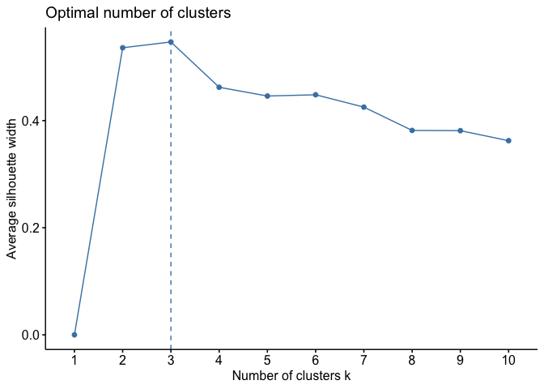

<!-- README.md is generated from README.Rmd. Please edit that file -->

# chooseGCM

<!-- badges: start -->
<!-- badges: end -->

The goal of chooseGCM is to help researchers aiming to project Species
Distribution Models and Ecological Niche Models to future scenarios by
applying a selection routing to the General Circulation Models.

## Installation

You can install the development version of chooseGCM from
[GitHub](https://github.com/) with:

``` r
# install.packages("devtools")
devtools::install_github("luizesser/chooseGCM")
```

## Tutorial

This is a basic tutorial which shows you how to use the functions in
chooseGCM. After installing the package, we need to open it:

``` r
library(chooseGCM)
#> Warning: replacing previous import 'cowplot::get_legend' by
#> 'ggpubr::get_legend' when loading 'chooseGCM'
#> Warning: replacing previous import 'dplyr::failwith' by 'plyr::failwith' when
#> loading 'chooseGCM'
#> Warning: replacing previous import 'dplyr::id' by 'plyr::id' when loading
#> 'chooseGCM'
#> Warning: replacing previous import 'dplyr::summarize' by 'plyr::summarize' when
#> loading 'chooseGCM'
#> Warning: replacing previous import 'dplyr::count' by 'plyr::count' when loading
#> 'chooseGCM'
#> Warning: replacing previous import 'dplyr::desc' by 'plyr::desc' when loading
#> 'chooseGCM'
#> Warning: replacing previous import 'ggpubr::mutate' by 'plyr::mutate' when
#> loading 'chooseGCM'
#> Warning: replacing previous import 'dplyr::arrange' by 'plyr::arrange' when
#> loading 'chooseGCM'
#> Warning: replacing previous import 'dplyr::rename' by 'plyr::rename' when
#> loading 'chooseGCM'
#> Warning: replacing previous import 'dplyr::summarise' by 'plyr::summarise' when
#> loading 'chooseGCM'
#> The legacy packages maptools, rgdal, and rgeos, underpinning this package
#> will retire shortly. Please refer to R-spatial evolution reports on
#> https://r-spatial.org/r/2023/05/15/evolution4.html for details.
#> This package is now running under evolution status 0
#> Warning: replacing previous import 'dplyr::union' by 'raster::union' when
#> loading 'chooseGCM'
#> Warning: replacing previous import 'ggpubr::rotate' by 'raster::rotate' when
#> loading 'chooseGCM'
#> Warning: replacing previous import 'dplyr::select' by 'raster::select' when
#> loading 'chooseGCM'
#> Warning: replacing previous import 'dplyr::intersect' by 'raster::intersect'
#> when loading 'chooseGCM'
#> Warning: replacing previous import 'raster::density' by 'stats::density' when
#> loading 'chooseGCM'
#> Warning: replacing previous import 'raster::weighted.mean' by
#> 'stats::weighted.mean' when loading 'chooseGCM'
#> Warning: replacing previous import 'raster::predict' by 'stats::predict' when
#> loading 'chooseGCM'
#> Warning: replacing previous import 'raster::aggregate' by 'stats::aggregate'
#> when loading 'chooseGCM'
#> Warning: replacing previous import 'dplyr::filter' by 'stats::filter' when
#> loading 'chooseGCM'
#> Warning: replacing previous import 'dplyr::lag' by 'stats::lag' when loading
#> 'chooseGCM'
#> Warning: replacing previous import 'raster::quantile' by 'stats::quantile' when
#> loading 'chooseGCM'
#> Warning: replacing previous import 'raster::update' by 'stats::update' when
#> loading 'chooseGCM'
#> Warning: replacing previous import 'raster::tail' by 'utils::tail' when loading
#> 'chooseGCM'
#> Warning: replacing previous import 'raster::stack' by 'utils::stack' when
#> loading 'chooseGCM'
#> Warning: replacing previous import 'raster::unstack' by 'utils::unstack' when
#> loading 'chooseGCM'
#> Warning: replacing previous import 'raster::head' by 'utils::head' when loading
#> 'chooseGCM'
```

### Downloading WorldClim 2.1 data

First, we need to use only one time period. Here we use 2090 so the
difference between models is more conspicuous. In the same way we are
considering the SSP585, which is the more dramatic pathway. The
resolution is the lowest to be quicker. The aim here is to maintain all
parameters equal, but General Circulation Models (GCMs). In this way we
know that the only source of variation comes from them. Note that if you
receive a timeout error you can increase timeout value by running ,
where 600 is the value in seconds that will be enough to download the
data.

``` r
gcm_names <- sort(c('ac','ip','me','mi','mp','ml'))

# WorldClim_data(period = 'future', variable = 'bioc', year = '2090', gcm = gcm_names, ssp = '585', resolution = 10)
```

### Importing and transforming data

Now let’s import GCMs to R in a list of stacks and name the list with
the names of the GCMs.

``` r
s <- list.files('inst/input_data/WorldClim_data_future', pattern = '.tif', full.names = T) |>
  lapply(function(x){s <- raster::stack(x)
                     names(s) <- paste0('bio_',1:19) # Rename rasters
                     return(s)})
names(s) <- gcm_names
```

In each function, data will be transformed. To do that you will always
need to provide at least: (1) the list of stacks, (2) the variables you
want to use in analysis and (3) the shapefile of your study area.

``` r
var_names <- c('bio_1', 'bio_12')
study_area <- raster::extent(c(-57, -22, -48, -33)) # you can use a shapefile here
```

### Exploratory analysis

In chooseGCM we implemented functions to analyze GCMs attributes.

``` r
# Summary of GCMs
s_sum <- summary_gcms(s, var_names, study_area)
s_sum
#> $ac
#>          min quantile_0.25 median       mean quantile_0.75    max         sd
#> bio_1   18.5          20.6   21.1   20.93511          21.3   22.4  0.6729885
#> bio_12 913.6        1247.9 1301.3 1279.45467        1337.1 1428.6 96.8010876
#>          NAs n_cells
#> bio_1  18675   18900
#> bio_12 18675   18900
#> 
#> $ip
#>           min quantile_0.25 median       mean quantile_0.75    max          sd
#> bio_1    18.6          20.8   21.1   21.02133          21.4   22.3   0.6173736
#> bio_12 1050.9        1449.7 1497.3 1472.14978        1525.6 1623.0 101.0357594
#>          NAs n_cells
#> bio_1  18675   18900
#> bio_12 18675   18900
#> 
#> $me
#>          min quantile_0.25 median     mean quantile_0.75    max         sd
#> bio_1   17.2          18.8   19.2   19.120          19.5   20.5  0.6005206
#> bio_12 924.9        1323.6 1369.0 1341.552        1395.1 1476.6 98.6417447
#>          NAs n_cells
#> bio_1  18675   18900
#> bio_12 18675   18900
#> 
#> $mi
#>          min quantile_0.25 median       mean quantile_0.75    max         sd
#> bio_1   17.0          18.6   19.0   18.96844          19.3   20.3  0.5977859
#> bio_12 924.2        1303.0 1352.7 1326.58311        1382.9 1456.7 96.3602897
#>          NAs n_cells
#> bio_1  18675   18900
#> bio_12 18675   18900
#> 
#> $ml
#>          min quantile_0.25 median       mean quantile_0.75    max          sd
#> bio_1   17.4          19.1   19.6   19.50622          20.0   21.0   0.6787307
#> bio_12 914.5        1314.5 1364.8 1343.51645        1408.7 1494.3 107.0979526
#>          NAs n_cells
#> bio_1  18675   18900
#> bio_12 18675   18900
#> 
#> $mp
#>          min quantile_0.25 median       mean quantile_0.75    max          sd
#> bio_1   17.4          19.1   19.6   19.50622          20.0   21.0   0.6787307
#> bio_12 914.5        1314.5 1364.8 1343.51645        1408.7 1494.3 107.0979526
#>          NAs n_cells
#> bio_1  18675   18900
#> bio_12 18675   18900
```

``` r
# Pearson Correlation between GCMs
s_cor <- cor_gcms(s, var_names, study_area, method = "pearson")
s_cor
#> $cor_matrix
#>           ac        ip        me        mi        ml        mp
#> ac 1.0000000 0.9772652 0.9772104 0.9683704 0.9672557 0.9672557
#> ip 0.9772652 1.0000000 0.9911019 0.9886388 0.9772004 0.9772004
#> me 0.9772104 0.9911019 1.0000000 0.9958763 0.9726183 0.9726183
#> mi 0.9683704 0.9886388 0.9958763 1.0000000 0.9605683 0.9605683
#> ml 0.9672557 0.9772004 0.9726183 0.9605683 1.0000000 1.0000000
#> mp 0.9672557 0.9772004 0.9726183 0.9605683 1.0000000 1.0000000
#> 
#> $cor_plot
```


``` r
# Euclidean Distance between GCMs
s_dist <- dist_gcms(s, var_names, study_area, method = "euclidean")
s_dist
#> $distances
#>          ac       ip       me       mi       ml
#> ip 41.36560                                    
#> me 41.41541 25.87875                           
#> mi 48.79107 29.24194 17.61715                  
#> ml 49.64341 41.42447 45.39663 54.47737         
#> mp 49.64341 41.42447 45.39663 54.47737  0.00000
#> 
#> $heatmap
```


### Obtain clusters

Clusters in chooseGCM are obtained through k-means, a unsupervised
machine learning algorithm. k is the number of clusters, which in this
case is the number of GCMs the modeller wants to use in projections.To
build a distance matrix considering multiple variables to each GCM we
use a flattening strategy, where values are concatenated in one unique
vector to each GCM. In the process, we need to scale variables so they
end up with the same measure. This matrix will be used to calculate the
clusters.

``` r
kmeans_gcms(s, var_names, study_area, k = 3,  method = "euclidean")
```


Alternatively, one could run the analysis with raw environmental data by
not setting any value to method.

``` r
kmeans_gcms(s, var_names, study_area, k = 3)
```


We can also obtain clusters through hierarchical clustering.

``` r
hclust_gcms(s, var_names, study_area, k = 3, n = 1000)
#> Warning: The `<scale>` argument of `guides()` cannot be `FALSE`. Use "none" instead as
#> of ggplot2 3.3.4.
#> ℹ The deprecated feature was likely used in the factoextra package.
#>   Please report the issue at <https://github.com/kassambara/factoextra/issues>.
#> This warning is displayed once every 8 hours.
#> Call `lifecycle::last_lifecycle_warnings()` to see where this warning was
#> generated.
```


But how many clusters are good? There is metrics to understand that.

``` r
optimize_clusters(s, var_names, study_area, method = 'wss', n = 1000)
```


``` r
optimize_clusters(s, var_names, study_area, method = 'silhouette', n = 1000)
```



``` r
optimize_clusters(s, var_names, study_area, method = 'gap_stat', n = 1000)
```


### Putting everything together

There is the option to run each function in a separate to better
understand what is happening and to better parameterize each step.
However there is a wrapper to help run everything at once.

``` r
compare_gcms(s, var_names, study_area, k = 3)
#> $suggested_gcms
#>    1    2    3 
#> "me" "ml" "ac" 
#> 
#> $statistics_gcms
```


