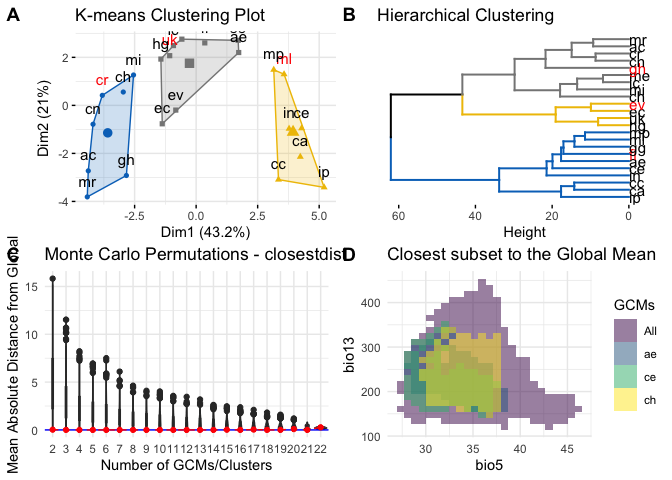
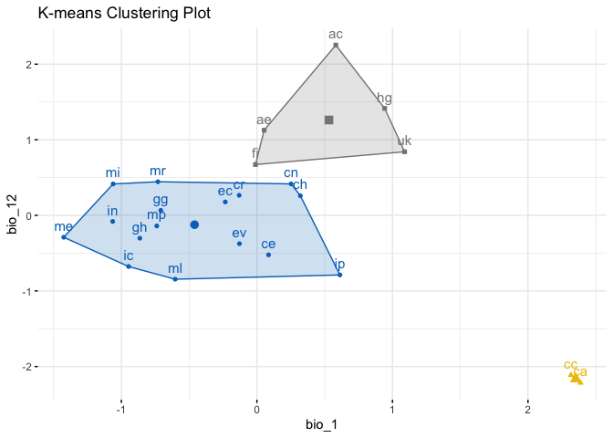
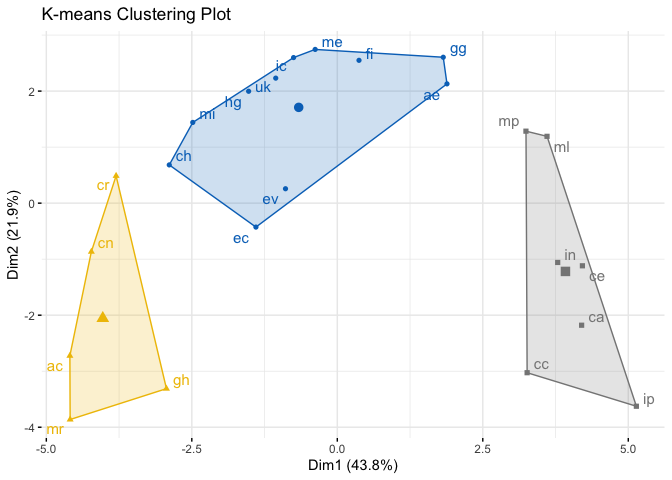
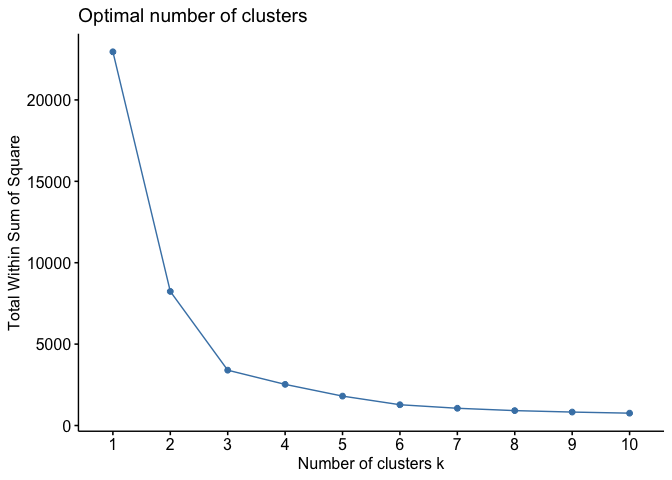
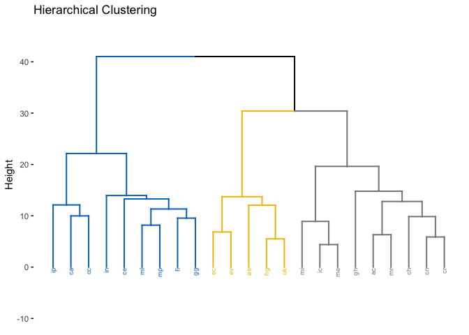
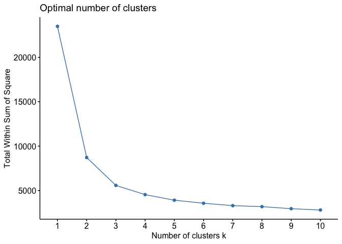
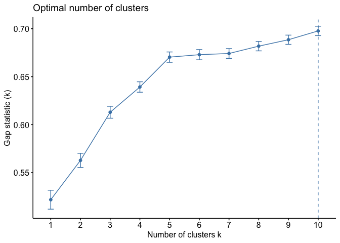
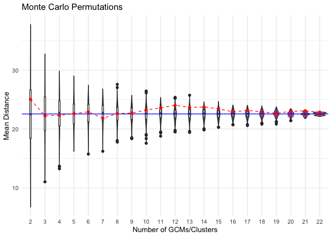
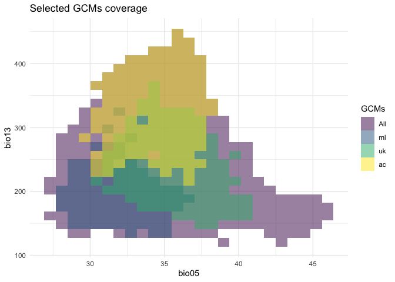
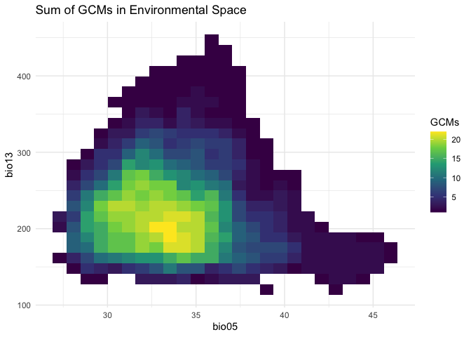

<!-- README.md is generated from README.Rmd. Please edit that file -->

# chooseGCM: an R package with a toolkit to select General Circulation Models

<!-- badges: start -->

[](https://github.com/luizesser/chooseGCM/actions/workflows/R-CMD-check.yaml)
<!-- badges: end -->

# chooseGCM <a href="https://luizesser.github.io/chooseGCM/"></a>

The goal of chooseGCM is to help researchers aiming to project Species
Distribution Models and Ecological Niche Models to future scenarios by
applying a selection routine to the General Circulation Models.

## Installation

You can install the development version of chooseGCM from
[GitHub](https://github.com/luizesser/chooseGCM) with:

``` r
install.packages("devtools")
devtools::install_github("luizesser/chooseGCM")
```

The package is also available on CRAN. Users are able to install it
using the following code:

``` r
install.packages("chooseGCM")
```

## Tutorial

This is a basic tutorial which shows you how to use the functions in
chooseGCM. After installing the package, we need to open it:

``` r
library(chooseGCM)
#> Warning: package 'chooseGCM' was built under R version 4.3.3
tictoc::tic()
set.seed(1)
```

### Downloading WorldClim 2.1 Data

First, we need to use only one time period. Here we use 2090 so the
difference between models is more conspicuous. In the same way we are
considering the SSP585, which is the more dramatic pathway. The
resolution is the lowest to be quicker. The aim here is to maintain all
parameters equal, but General Circulation Models (GCMs). In this way we
know that the only source of variation comes from them. Note that if you
receive a timeout error you can increase timeout value by running ,
where 600 is the value in seconds that will be enough to download the
data.

``` r
worldclim_data(path = "input_data/WorldClim_data_gcms_all", period = "future", variable = "bioc", year = "2090", gcm = "all", ssp = "585", resolution = 10)
```

### Importing and Transforming Data

Now let’s import GCMs to R in a list of stacks and name the list with
the names of the GCMs.

``` r
s <- import_gcms()
names(s) <- gsub("_ssp585_10_2090", "", names(s))
```

In each function, data will be transformed. To do that you will always
need to provide at least: (1) the list of stacks, (2) the variables you
want to use in analysis and (3) the shapefile of your study area. You
don’t need to previously mask and subset your data, once the functions
will perform this task internally for you. Note that the results from
these functions are highly sensitive to variables and to study area. In
this sense, the decision on what variables should be considered and what
is the study area must be carefully made considering biological aspects
of the studied group.

``` r
var_names <- c("bio5", "bio13", "bio15")
study_area_parana <- terra::vect("input_data/PR_UF_2022.shp")
```

### Straigthforward Approach

There is the option to run each function in separate to better
understand what is happening and to better parameterize each step.
However there is a wrapper to help run everything at once and could be
an alternative to have a broad perspective. `compare_gcms()` will return
a list with a vector called `suggested_gcms` and a Figure called
`statistics_gcms`. We suggest that this Figure could also be included as
it is in supplementary data from studies using this package.

``` r
res <- compare_gcms(s, var_names, study_area_parana, k = 3)
#> CRS from s and study_area are not identical. Reprojecting study area.
#> Warning: The `<scale>` argument of `guides()` cannot be `FALSE`. Use "none" instead as
#> of ggplot2 3.3.4.
#> ℹ The deprecated feature was likely used in the factoextra package.
#>   Please report the issue at <https://github.com/kassambara/factoextra/issues>.
#> This warning is displayed once every 8 hours.
#> Call `lifecycle::last_lifecycle_warnings()` to see where this warning was
#> generated.
res$statistics_gcms
```



The aim of this function is to inform the minimum required so users can
follow with their workflow in a more straightforward fashion (more on
each plot further). If we see the D plot in the Figure, we can infer if
the selected GCMs encompass the environmental variety of all GCMs. The
focus should be to cover the core environment and not outlier regions on
the environmental space. Above that, in plot B, the Monte Carlo
permutation between GCMs is presented as a violin plot. Plots A and C
are both clusterization methods that can be used to select GCMs.
Clusterization will be adapted to the number of clusters `k` designated
in the function. Lastly, suggested GCMs were “uk”, “ml” and “ac”. Those
suggestions are the gcms that are closer to the centroid of each K-means
cluster, thus they better represent the variation within each cluster.

### Deep-dive Approach

As an alternative for experienced modelers that want to deeply
understand the impacts of decisions on GCMs selection, we prepared a set
of functions to analyze data more carefully. Each function in the
wrapper mentioned above is available to be explored as stand-alone,
ranging from exploratory analysis to cluster analysis and methods to
determine the optimum number of clusters.

#### Exploratory Analysis

In chooseGCM we implemented functions to analyze GCMs attributes.
`summary_gcms` is the only function available that describes variations
within GCMs. It returns the internal information regarding each
variable, as reads: minimum value (min), first quartile (quantile_0.25),
second quartile (median), average (mean), third quartile
(quantile_0.75), maximum value (max), standard deviation (sd), number of
NAs (NAs) and the total number of cells (n_cells). This function returns
a list of GCMs with a table associated with each of them.

``` r
# Summary of GCMs
s_sum <- summary_gcms(s, var_names, study_area_parana)
#> CRS from s and study_area are not identical. Reprojecting study area.
s_sum
#> $ac
#>         min quantile_0.25 median      mean quantile_0.75   max        sd NAs
#> bio5   30.0        33.100  35.00  34.86172        36.600  38.9  2.074876   0
#> bio13 219.9       281.475 312.55 322.36596       367.075 447.1 49.906181   0
#> bio15  21.1        31.375  36.00  35.81045        40.000  52.8  6.702049   0
#>       n_cells
#> bio5      708
#> bio13     708
#> bio15     708
#> 
#> $ae
#>         min quantile_0.25 median      mean quantile_0.75   max        sd NAs
#> bio5   28.5         31.70   33.9  33.78263        35.800  39.0  2.457254   0
#> bio13 160.8        205.05  235.0 232.06681       253.825 346.4 33.968277   0
#> bio15  13.6         23.00   27.1  27.88164        32.400  49.9  7.270607   0
#>       n_cells
#> bio5      708
#> bio13     708
#> bio15     708
#> 
#> $ca
#>         min quantile_0.25 median      mean quantile_0.75   max        sd NAs
#> bio5   32.5        36.500  40.00  39.68842          42.8  45.8  3.514195   0
#> bio13 127.5       159.975 175.05 179.44336         196.3 257.1 24.683431   0
#> bio15  25.8        35.275  41.10  41.37500          46.7  63.0  8.097520   0
#>       n_cells
#> bio5      708
#> bio13     708
#> bio15     708
#> 
#> $cc
#>         min quantile_0.25 median      mean quantile_0.75   max        sd NAs
#> bio5   32.6        37.000  40.55  40.15946         43.20  46.2  3.572662   0
#> bio13 120.6       162.975 174.75 179.40975        190.85 259.9 22.865425   0
#> bio15  25.7        35.800  41.30  41.72189         46.80  64.0  8.117374   0
#>       n_cells
#> bio5      708
#> bio13     708
#> bio15     708
#> 
#> $ce
#>         min quantile_0.25 median      mean quantile_0.75   max        sd NAs
#> bio5   28.3        31.000  33.40  33.13842        35.200  37.6  2.403073   0
#> bio13 154.9       188.400 207.70 210.40833       228.425 352.4 30.119732   0
#> bio15  22.0        30.075  34.45  35.72034        39.700  61.8  7.868957   0
#>       n_cells
#> bio5      708
#> bio13     708
#> bio15     708
#> 
#> $ch
#>         min quantile_0.25 median      mean quantile_0.75   max        sd NAs
#> bio5   30.1        32.800  35.05  34.77429        36.800  38.2  2.234395   0
#> bio13 157.6       197.775 227.85 234.49393       265.825 349.1 42.809635   0
#> bio15  21.1        29.475  34.10  34.05184        37.600  50.8  6.025080   0
#>       n_cells
#> bio5      708
#> bio13     708
#> bio15     708
#> 
#> $cn
#>         min quantile_0.25 median      mean quantile_0.75   max        sd NAs
#> bio5   29.6        32.300  34.20  34.04647        35.900  37.8  2.027931   0
#> bio13 161.4       201.850 231.45 242.94816       284.025 365.6 50.184711   0
#> bio15  21.6        29.075  33.75  33.78065        37.800  50.2  5.937047   0
#>       n_cells
#> bio5      708
#> bio13     708
#> bio15     708
#> 
#> $cr
#>         min quantile_0.25 median      mean quantile_0.75   max        sd NAs
#> bio5   29.5        32.200  33.90  33.75946        35.400  37.4  1.883084   0
#> bio13 153.0       196.975 224.15 229.00833       258.900 324.9 38.503760   0
#> bio15  17.8        27.200  32.85  33.04746        37.925  52.0  7.394922   0
#>       n_cells
#> bio5      708
#> bio13     708
#> bio15     708
#> 
#> $ec
#>         min quantile_0.25 median      mean quantile_0.75   max        sd NAs
#> bio5   27.9        30.675   33.4  33.69082         36.50  40.5  3.351993   0
#> bio13 150.3       191.325  220.2 223.09661        250.45 346.0 38.320731   0
#> bio15  23.3        29.900   32.9  33.72924         37.40  48.7  5.068337   0
#>       n_cells
#> bio5      708
#> bio13     708
#> bio15     708
#> 
#> $ev
#>         min quantile_0.25 median      mean quantile_0.75   max        sd NAs
#> bio5   28.1        30.900  34.00  34.14223        37.100  40.9  3.463340   0
#> bio13 145.4       179.250 201.95 208.68517       233.375 360.9 37.829991   0
#> bio15  24.0        30.375  33.90  34.71398        37.925  52.0  5.387966   0
#>       n_cells
#> bio5      708
#> bio13     708
#> bio15     708
#> 
#> $fi
#>         min quantile_0.25 median      mean quantile_0.75   max        sd NAs
#> bio5   28.8        31.900   33.9  33.70833        35.500  38.4  2.115846   0
#> bio13 159.8       201.875  220.0 225.59816       249.950 337.8 31.579720   0
#> bio15  17.7        25.575   29.6  30.54816        34.125  52.2  6.641921   0
#>       n_cells
#> bio5      708
#> bio13     708
#> bio15     708
#> 
#> $gg
#>         min quantile_0.25 median      mean quantile_0.75   max        sd NAs
#> bio5   28.2        30.800   32.9  32.66977          34.5  36.6  2.085673   0
#> bio13 142.0       176.300  197.1 196.51299         213.4 318.6 24.392013   0
#> bio15  11.2        18.775   22.5  23.92542          27.7  46.7  7.175692   0
#>       n_cells
#> bio5      708
#> bio13     708
#> bio15     708
#> 
#> $gh
#>         min quantile_0.25 median      mean quantile_0.75   max        sd NAs
#> bio5   28.0          30.7  32.70  32.66201          34.6  36.5  2.203157   0
#> bio13 143.7         181.3 208.15 209.34831         237.4 298.2 31.727428   0
#> bio15  19.1          25.6  28.10  29.46328          32.8  50.2  5.975185   0
#>       n_cells
#> bio5      708
#> bio13     708
#> bio15     708
#> 
#> $hg
#>         min quantile_0.25 median      mean quantile_0.75   max        sd NAs
#> bio5   30.9         34.50   36.7  36.54675          38.7  41.1  2.422012   0
#> bio13 167.8        210.95  235.4 244.28701         275.6 379.1 41.653356   0
#> bio15  15.1         22.90   26.9  28.02090          31.9  48.7  6.589878   0
#>       n_cells
#> bio5      708
#> bio13     708
#> bio15     708
#> 
#> $ic
#>         min quantile_0.25 median      mean quantile_0.75   max        sd NAs
#> bio5   28.3          30.7  32.50  32.42048        34.000  36.4  1.904782   0
#> bio13 137.3         170.3 186.30 193.21328       213.925 298.1 28.865385   0
#> bio15  14.2          23.7  27.75  28.84816        33.100  51.6  7.323494   0
#>       n_cells
#> bio5      708
#> bio13     708
#> bio15     708
#> 
#> $`in`
#>         min quantile_0.25 median      mean quantile_0.75   max        sd NAs
#> bio5   28.4         30.80   32.5  32.48390        34.000  37.0  1.916037   0
#> bio13 144.7        184.70  199.9 202.81709       214.100 373.5 25.584168   0
#> bio15  13.6         23.55   28.0  28.86511        33.725  53.0  8.048436   0
#>       n_cells
#> bio5      708
#> bio13     708
#> bio15     708
#> 
#> $ip
#>         min quantile_0.25 median      mean quantile_0.75   max        sd NAs
#> bio5   29.5        32.775  35.85  35.53531        38.000  40.7  3.007477   0
#> bio13 146.1       181.250 194.60 197.31102       211.075 303.5 21.489514   0
#> bio15  15.5        26.300  32.80  33.45918        39.500  61.9  9.740520   0
#>       n_cells
#> bio5      708
#> bio13     708
#> bio15     708
#> 
#> $me
#>         min quantile_0.25 median      mean quantile_0.75   max        sd NAs
#> bio5   27.3        29.600  31.40  31.35099         32.90  35.3  1.922350   0
#> bio13 146.2       178.975 199.95 204.60650        226.55 316.6 30.141320   0
#> bio15  15.0        25.900  28.80  29.88912         33.70  51.1  6.898089   0
#>       n_cells
#> bio5      708
#> bio13     708
#> bio15     708
#> 
#> $mi
#>         min quantile_0.25 median      mean quantile_0.75   max        sd NAs
#> bio5   29.4          32.0   33.1  33.08404        34.200  37.0  1.512676   0
#> bio13 156.9         190.6  209.2 215.32712       239.725 324.6 30.799656   0
#> bio15  16.5          25.9   29.3  29.75071        33.400  45.1  5.750529   0
#>       n_cells
#> bio5      708
#> bio13     708
#> bio15     708
#> 
#> $ml
#>         min quantile_0.25 median      mean quantile_0.75   max        sd NAs
#> bio5   28.1        30.500  32.30  32.26709        34.000  36.9  1.986405   0
#> bio13 141.3       173.250 188.75 190.07288       202.850 339.6 24.659868   0
#> bio15  18.0        28.475  33.00  34.32472        39.825  58.6  8.764426   0
#>       n_cells
#> bio5      708
#> bio13     708
#> bio15     708
#> 
#> $mp
#>         min quantile_0.25 median      mean quantile_0.75   max        sd NAs
#> bio5   28.0        30.300   32.0  32.00975        33.700  36.0  1.958004   0
#> bio13 150.3       189.200  208.4 210.17571       228.250 307.4 28.119429   0
#> bio15  15.0        25.375   29.4  30.96271        36.025  54.1  8.204866   0
#>       n_cells
#> bio5      708
#> bio13     708
#> bio15     708
#> 
#> $mr
#>         min quantile_0.25 median      mean quantile_0.75   max        sd NAs
#> bio5   27.9         30.40  32.10  31.95650        33.500  36.2  1.846094   0
#> bio13 167.5        210.45 243.45 244.38249       275.625 330.1 38.147684   0
#> bio15  17.9         26.30  32.30  32.15833        37.100  50.9  7.384676   0
#>       n_cells
#> bio5      708
#> bio13     708
#> bio15     708
#> 
#> $uk
#>         min quantile_0.25 median      mean quantile_0.75   max        sd NAs
#> bio5   31.0         34.10  36.30  36.29322        38.425  41.5  2.521581   0
#> bio13 154.9        198.90 228.45 234.27839       267.700 379.0 44.507444   0
#> bio15  17.2         25.75  30.40  30.85268        35.400  49.4  6.709703   0
#>       n_cells
#> bio5      708
#> bio13     708
#> bio15     708
```

Regarding the exploratory comparison between GCMs, two functions are
available: `cor_gcms` and `dist_gcms`. The first is designed to return a
list with a correlation matrix between GCMs and a plot of this matrix.
We noticed while building this package that (as expected) Pearson
correlation values are always very high, rarely reaching values bellow
0.95. In this way we found that this function could not be so
informative and decided to present a distance function as seen bellow.
However it is noteworthy that through this function the user can change
the method used to obtain correlation values. See `?cor_gcms` for
available methods.

``` r
# Pearson Correlation between GCMs
s_cor <- cor_gcms(s, var_names, study_area_parana, scale = TRUE, method = "pearson")
#> CRS from s and study_area are not identical. Reprojecting study area.
#> Scale for fill is already present.
#> Adding another scale for fill, which will replace the existing scale.
s_cor
#> $cor_matrix
#>           ac        ae        ca        cc        ce        ch        cn
#> ac 1.0000000 0.8222687 0.7474311 0.7774549 0.7167943 0.9268093 0.9705559
#> ae 0.8222687 1.0000000 0.9075920 0.8684687 0.9056885 0.8965440 0.8660992
#> ca 0.7474311 0.9075920 1.0000000 0.9521852 0.9178031 0.8053916 0.7686080
#> cc 0.7774549 0.8684687 0.9521852 1.0000000 0.8748224 0.8134863 0.7971570
#> ce 0.7167943 0.9056885 0.9178031 0.8748224 1.0000000 0.8312629 0.7644923
#> ch 0.9268093 0.8965440 0.8053916 0.8134863 0.8312629 1.0000000 0.9490186
#> cn 0.9705559 0.8660992 0.7686080 0.7971570 0.7644923 0.9490186 1.0000000
#> cr 0.9691325 0.8842913 0.8096930 0.8327782 0.7979551 0.9630363 0.9822591
#> ec 0.8343692 0.9127519 0.8020561 0.7876387 0.8074572 0.9011960 0.8806919
#> ev 0.8169534 0.9056375 0.8176688 0.8129450 0.8414429 0.9033529 0.8796525
#> fi 0.8569444 0.9222062 0.8706602 0.8629006 0.9037687 0.9076577 0.8968552
#> gg 0.8361983 0.9446917 0.8888227 0.8699211 0.9263903 0.8969800 0.8727610
#> gh 0.9095465 0.8323123 0.7526228 0.7742805 0.7357975 0.8831682 0.9156861
#> hg 0.8803762 0.9315005 0.8310857 0.8190898 0.8321600 0.9112541 0.9105055
#> ic 0.9054854 0.9192470 0.8788078 0.8766609 0.8760764 0.9474036 0.9280161
#> in 0.7282736 0.8899251 0.8582211 0.8718917 0.9011865 0.8105449 0.7691032
#> ip 0.6779757 0.8951112 0.9425874 0.9230164 0.9029984 0.7510189 0.7040445
#> me 0.8923514 0.9315303 0.8733456 0.8653210 0.8743066 0.9338734 0.9203804
#> mi 0.9337973 0.8932566 0.8100739 0.8231812 0.8117599 0.9402452 0.9421741
#> ml 0.7753140 0.9282318 0.8972975 0.8748226 0.9370699 0.8479921 0.8126015
#> mp 0.7947834 0.9473006 0.9215585 0.8696344 0.9364209 0.8622084 0.8305043
#> mr 0.9795831 0.7847647 0.7157671 0.7568350 0.6828909 0.9117137 0.9534145
#> uk 0.8668021 0.9425931 0.8568111 0.8376745 0.8446538 0.9187139 0.9032580
#>           cr        ec        ev        fi        gg        gh        hg
#> ac 0.9691325 0.8343692 0.8169534 0.8569444 0.8361983 0.9095465 0.8803762
#> ae 0.8842913 0.9127519 0.9056375 0.9222062 0.9446917 0.8323123 0.9315005
#> ca 0.8096930 0.8020561 0.8176688 0.8706602 0.8888227 0.7526228 0.8310857
#> cc 0.8327782 0.7876387 0.8129450 0.8629006 0.8699211 0.7742805 0.8190898
#> ce 0.7979551 0.8074572 0.8414429 0.9037687 0.9263903 0.7357975 0.8321600
#> ch 0.9630363 0.9011960 0.9033529 0.9076577 0.8969800 0.8831682 0.9112541
#> cn 0.9822591 0.8806919 0.8796525 0.8968552 0.8727610 0.9156861 0.9105055
#> cr 1.0000000 0.8776602 0.8724489 0.9098074 0.9079947 0.9211805 0.9140094
#> ec 0.8776602 1.0000000 0.9769223 0.8868706 0.8580796 0.8348469 0.9380815
#> ev 0.8724489 0.9769223 1.0000000 0.9062918 0.8722129 0.8188413 0.9419239
#> fi 0.9098074 0.8868706 0.9062918 1.0000000 0.9519619 0.8772080 0.9532942
#> gg 0.9079947 0.8580796 0.8722129 0.9519619 1.0000000 0.8811838 0.9099544
#> gh 0.9211805 0.8348469 0.8188413 0.8772080 0.8811838 1.0000000 0.8726213
#> hg 0.9140094 0.9380815 0.9419239 0.9532942 0.9099544 0.8726213 1.0000000
#> ic 0.9546310 0.8483330 0.8627452 0.9296029 0.9459835 0.8699525 0.9063314
#> in 0.8100512 0.7569568 0.7872102 0.8826283 0.9284360 0.7320099 0.8306961
#> ip 0.7559461 0.7610442 0.7798539 0.8325963 0.8884159 0.7182954 0.7899106
#> me 0.9459077 0.8525521 0.8606391 0.9276727 0.9555618 0.8781822 0.9111763
#> mi 0.9673688 0.8619600 0.8608742 0.9137696 0.9209719 0.8794114 0.9174088
#> ml 0.8521561 0.8134999 0.8414814 0.9292883 0.9662060 0.8059491 0.8796716
#> mp 0.8569821 0.8328734 0.8502194 0.9424687 0.9471829 0.8181316 0.8958994
#> mr 0.9639171 0.8059929 0.7903033 0.8414630 0.8243951 0.9301743 0.8539005
#> uk 0.9122260 0.9513474 0.9587427 0.9359819 0.9042681 0.8424736 0.9848288
#>           ic        in        ip        me        mi        ml        mp
#> ac 0.9054854 0.7282736 0.6779757 0.8923514 0.9337973 0.7753140 0.7947834
#> ae 0.9192470 0.8899251 0.8951112 0.9315303 0.8932566 0.9282318 0.9473006
#> ca 0.8788078 0.8582211 0.9425874 0.8733456 0.8100739 0.8972975 0.9215585
#> cc 0.8766609 0.8718917 0.9230164 0.8653210 0.8231812 0.8748226 0.8696344
#> ce 0.8760764 0.9011865 0.9029984 0.8743066 0.8117599 0.9370699 0.9364209
#> ch 0.9474036 0.8105449 0.7510189 0.9338734 0.9402452 0.8479921 0.8622084
#> cn 0.9280161 0.7691032 0.7040445 0.9203804 0.9421741 0.8126015 0.8305043
#> cr 0.9546310 0.8100512 0.7559461 0.9459077 0.9673688 0.8521561 0.8569821
#> ec 0.8483330 0.7569568 0.7610442 0.8525521 0.8619600 0.8134999 0.8328734
#> ev 0.8627452 0.7872102 0.7798539 0.8606391 0.8608742 0.8414814 0.8502194
#> fi 0.9296029 0.8826283 0.8325963 0.9276727 0.9137696 0.9292883 0.9424687
#> gg 0.9459835 0.9284360 0.8884159 0.9555618 0.9209719 0.9662060 0.9471829
#> gh 0.8699525 0.7320099 0.7182954 0.8781822 0.8794114 0.8059491 0.8181316
#> hg 0.9063314 0.8306961 0.7899106 0.9111763 0.9174088 0.8796716 0.8958994
#> ic 1.0000000 0.8999898 0.8308173 0.9892832 0.9655308 0.9151176 0.9152311
#> in 0.8999898 1.0000000 0.9025073 0.9086389 0.8676851 0.9544238 0.9068221
#> ip 0.8308173 0.9025073 1.0000000 0.8357345 0.7720280 0.9178104 0.8995446
#> me 0.9892832 0.9086389 0.8357345 1.0000000 0.9647568 0.9274873 0.9223096
#> mi 0.9655308 0.8676851 0.7720280 0.9647568 1.0000000 0.8871476 0.8759186
#> ml 0.9151176 0.9544238 0.9178104 0.9274873 0.8871476 1.0000000 0.9691976
#> mp 0.9152311 0.9068221 0.8995446 0.9223096 0.8759186 0.9691976 1.0000000
#> mr 0.8886704 0.7098175 0.6638051 0.8707488 0.9205766 0.7609427 0.7701088
#> uk 0.9158877 0.8344505 0.8072126 0.9200012 0.9172428 0.8817465 0.8961938
#>           mr        uk
#> ac 0.9795831 0.8668021
#> ae 0.7847647 0.9425931
#> ca 0.7157671 0.8568111
#> cc 0.7568350 0.8376745
#> ce 0.6828909 0.8446538
#> ch 0.9117137 0.9187139
#> cn 0.9534145 0.9032580
#> cr 0.9639171 0.9122260
#> ec 0.8059929 0.9513474
#> ev 0.7903033 0.9587427
#> fi 0.8414630 0.9359819
#> gg 0.8243951 0.9042681
#> gh 0.9301743 0.8424736
#> hg 0.8539005 0.9848288
#> ic 0.8886704 0.9158877
#> in 0.7098175 0.8344505
#> ip 0.6638051 0.8072126
#> me 0.8707488 0.9200012
#> mi 0.9205766 0.9172428
#> ml 0.7609427 0.8817465
#> mp 0.7701088 0.8961938
#> mr 1.0000000 0.8358686
#> uk 0.8358686 1.0000000
#> 
#> $cor_plot
```



The function `dist_gcms` is very similar to the previous `cor_gcms`, but
now for distances. This function has the same output: a list with two
slots. One is the distance matrix obtained (`distances`), while the
second is the plotted matrix (`heatmap`). Here the differences between
GCMs are way more clear than in the previous plot. As in was it the
previous function, methods can also be changed for a number of different
distances. For a complete list of available methods see `?dist_gcms`. To
build a distance matrix considering multiple variables to each GCM we
use a flattening strategy, where values are concatenated in one unique
vector to each GCM. In the process, we need to scale variables so they
end up with the same measure. This matrix is also used to calculate the
clusters in the `compare_gcms` function and in further presented
`kmeans_gcms` function.

``` r
# Euclidean Distance between GCMs
s_dist <- dist_gcms(s, var_names, study_area_parana, method = "euclidean")
#> CRS from s and study_area are not identical. Reprojecting study area.
s_dist
#> $distances
#>           ac        ae        ca        cc        ce        ch        cn
#> ae 27.457895                                                            
#> ca 32.732203 19.798860                                                  
#> cc 30.725172 23.621087 14.241854                                        
#> ce 34.660621 20.001733 18.672952 23.043507                              
#> ch 17.620294 20.948998 28.732019 28.128117 26.754119                    
#> cn 11.175950 23.832900 31.329937 29.333598 31.607333 14.705889          
#> cr 11.442906 22.154824 28.412712 26.633714 29.275833 12.521988  8.675084
#> ec 26.506714 19.238150 28.977199 30.013939 28.579129 20.472582 22.496777
#> ev 27.865456 20.007141 27.810948 28.168904 25.934520 20.247885 22.594555
#> fi 24.634157 18.165940 23.423478 24.115879 20.204291 19.791814 20.917458
#> gg 26.359949 15.317246 21.716675 23.490313 17.670668 20.904802 23.232477
#> gh 19.588360 26.670797 32.394042 30.943534 33.477561 22.262089 18.911886
#> hg 22.526522 17.046255 26.768161 27.702366 26.682906 19.402577 19.484241
#> ic 20.023255 18.508222 22.673719 22.873663 22.927799 14.937002 17.474431
#> in 33.950895 21.608741 24.523987 23.311700 20.473567 28.349045 31.296391
#> ip 36.959802 21.093560 15.605901 18.071093 20.284986 32.498892 35.432236
#> me 21.369263 17.042550 23.179037 23.902055 23.090934 16.748404 18.377875
#> mi 16.758037 21.279227 28.384267 27.387319 28.258000 15.921046 15.661970
#> ml 30.872612 17.448232 20.872570 23.043491 16.338584 25.393260 28.194756
#> mp 29.504725 14.951613 18.241404 23.516182 16.422628 24.176679 26.814186
#> mr  9.306375 30.216354 34.723419 32.117069 36.676655 19.352276 14.057585
#> uk 23.770265 15.605130 24.645638 26.240896 25.670581 18.569218 20.257831
#>           cr        ec        ev        fi        gg        gh        hg
#> ae                                                                      
#> ca                                                                      
#> cc                                                                      
#> ce                                                                      
#> ch                                                                      
#> cn                                                                      
#> cr                                                                      
#> ec 22.780809                                                            
#> ev 23.260949  9.894212                                                  
#> fi 19.560086 21.906508 19.937655                                        
#> gg 19.755666 24.536227 23.282458 14.275065                              
#> gh 18.285302 26.468458 27.721383 22.822875 22.450349                    
#> hg 19.099005 16.206729 15.695823 14.075731 19.544146 23.245220          
#> ic 13.872819 25.364769 24.129542 17.280753 15.137311 23.487476 19.933441
#> in 28.385959 32.109024 30.044207 22.313464 17.423388 33.716675 26.799015
#> ip 32.175715 31.837877 30.559121 26.648202 21.756368 34.568640 29.852961
#> me 15.147923 25.009482 24.313969 17.516066 13.729787 22.732162 19.411087
#> mi 11.765269 24.198469 24.293452 19.125616 18.309482 22.617182 18.717687
#> ml 25.043041 28.127092 25.931371 17.319323 11.973056 28.690830 22.592768
#> mp 24.630915 26.626136 25.206530 15.622025 14.968311 27.775635 21.014155
#> mr 12.371887 28.687594 29.825044 25.932873 27.293150 17.210474 24.894862
#> uk 19.296049 14.366086 13.229262 16.479221 20.151788 25.850089  8.022238
#>           ic        in        ip        me        mi        ml        mp
#> ae                                                                      
#> ca                                                                      
#> cc                                                                      
#> ce                                                                      
#> ch                                                                      
#> cn                                                                      
#> cr                                                                      
#> ec                                                                      
#> ev                                                                      
#> fi                                                                      
#> gg                                                                      
#> gh                                                                      
#> hg                                                                      
#> ic                                                                      
#> in 20.597166                                                            
#> ip 26.789418 20.336277                                                  
#> me  6.742450 19.686381 26.397241                                        
#> mi 12.092083 23.691342 31.097544 12.227094                              
#> ml 18.975546 13.904473 18.672125 17.538492 21.879667                    
#> mp 18.962846 19.881161 20.642960 18.153856 22.942395 11.430818          
#> mr 21.731544 35.084958 37.764252 23.415458 18.355224 31.844637 31.228167
#> uk 18.889262 26.500209 28.597273 18.421590 18.736489 22.397128 20.984422
#>           mr
#> ae          
#> ca          
#> cc          
#> ce          
#> ch          
#> cn          
#> cr          
#> ec          
#> ev          
#> fi          
#> gg          
#> gh          
#> hg          
#> ic          
#> in          
#> ip          
#> me          
#> mi          
#> ml          
#> mp          
#> mr          
#> uk 26.386464
#> 
#> $heatmap
```



#### Obtain Clusters

Clusters in chooseGCM are obtained through K-means, a unsupervised
machine learning algorithm. K in this case is the number of GCMs the
modeler wants to use in projections. As in the previous `dist_gcms`
function, we can address different methods to obtain the distance matrix
by changing the `method` argument. The K-means algorithm uses the
distance matrix to obtain clusters, thus a deep analysis of distances
using `dist_gcms` function could prove to be useful. As in
`compare_gcms` function, this function returns the K-means plot and a
set of suggested GCMs, i.e. the GCMs closer to the centroid of each
clusters.

``` r
kmeans_gcms(s, var_names, study_area_parana, k = 3, method = "euclidean")
#> CRS from s and study_area are not identical. Reprojecting study area.
#> $suggested_gcms
#>    1    2    3 
#> "uk" "cr" "ml" 
#> 
#> $kmeans_plot
```



Alternatively, instead of using distances, one could run the analysis
with raw environmental data by not setting any value to method (note how
axis change). As in the previous case, the function also returns GCMs
that are closer to the centroids. Note however that the plot below has a
cluster with two GCMs, thus both have the same distance from the
centroid. In this case, the function randomly suggests one of them. To
perform this analysis without a distance matrix, we use only the mean
values of each variable selected. In this way, the variability within
variables is not considered, as in the above solution. But we recognize
that for some purpose it could be useful to have a plot with raw
variables as axis as provided here.

``` r
kmeans_gcms(s, var_names, study_area_parana, k = 3)
#> CRS from s and study_area are not identical. Reprojecting study area.
#> $suggested_gcms
#> [1] "ic" "gh" "in"
#> 
#> $kmeans_plot
```


We can also obtain clusters through hierarchical clustering. In this
case, however, the function doesn’t suggest any GCM. It is up to the
user to define which GCMs are most suitable in this case. Hierarchical
clustering is useful to visually inform the relationship between groups
and could also be used to choose a number of clusters to build (together
with metrics in the next section).

``` r
hclust_gcms(s, var_names, study_area_parana, k = 3)
#> CRS from s and study_area are not identical. Reprojecting study area.
#> $suggested_gcms
#> [1] "gh" "fi" "ev"
#> 
#> $dend_plot
```



In this function we also provide a `n` argument to inform the amount of
data to be used in the clustering. This proved valuable when using high
resolution data.

``` r
hclust_gcms(s, var_names, study_area_parana, k = 3, n = 1000)
#> CRS from s and study_area are not identical. Reprojecting study area.
#> $suggested_gcms
#> [1] "gh" "ml" "fi"
#> 
#> $dend_plot
```



#### Number of Clusters

But how many clusters are good? There is three metrics implemented to
understand that. All of them are a way to see the minimum amount of GCMs
that are needed to encompass the variability in the whole set of GCMs.
The three methods are implemented in the same function by adjusting the
`method` argument. Within-cluster sum of squares (wss) calculates the
internal variability within clusters. Our goal here is to search for the
minimum amount of clusters that has the minimum amount of variability.
This is shown in the graph were the line changes abruptly its direction
(Number of clusters k = 3). As in the previous function, this function
provides a `n` argument to inform the amount of data to be used in the
clustering. Finally, one can also indicate the method to build clusters
with the argument `clusters`. Available methods are ‘kmeans’ (standard)
and ‘hclust’.

``` r
optk_gcms(s, var_names, study_area_parana, cluster = "kmeans", method = "wss", n = 1000)
#> CRS from s and study_area are not identical. Reprojecting study area.
```


The Average Silhouette Width method, measures the mean distance from all
individuals to the centroid of their own clusters, while comparing to
other clusters. This is sometimes also referred as a metric of cluster
quality (the higher the better). A number of clusters is the best when
the distance from individuals within the cluster to its centroid is
lower than the distance from individuals to other clusters centroid
(maximizing the average silhouette width). In this method, the best
number of clusters is marked with a dashed line (2 clusters).

``` r
optk_gcms(s, var_names, study_area_parana, cluster = "kmeans", method = "silhouette", n = 1000)
#> CRS from s and study_area are not identical. Reprojecting study area.
```



Our last method is the Gap Statistics. As in the previous method, here
the optimum number of clusters is showed with a dashed line (1 cluster).
This method compares the variation within clusters with a set of null
clusters build through Monte Carlo (“bootstrap”) sampling. Because of
that, the gap statistics can take a longer time to run when compared to
previous methods described here. Moreover, some parameters can be
changed to improve the Monte Carlo process, such as: `nstart`, `K.max`
and `B`, where `nstart` is the initial number of arrangements to be
compared, `K.max` is the maximum number of clusters to be created and B
is the number of bootstrap permutations.

``` r
optk_gcms(s, var_names, study_area_parana, cluster = "kmeans", method = "gap_stat", n = 1000)
#> CRS from s and study_area are not identical. Reprojecting study area.
#> Warning: did not converge in 10 iterations
#> Warning: did not converge in 10 iterations
#> Warning: did not converge in 10 iterations
#> Warning: did not converge in 10 iterations
#> Warning: did not converge in 10 iterations
```



#### Monte Carlo permutations

An alternative way to analyse if the mean distance between GCMs is
similar to the mean distance between all GCMs is to use the
`montecarlo_gcms` function. This function will build a distance matrix
(using `method` argument) and plot the mean distance between all GCMs as
a blue line. Afterwards, it will run a Monte Carlo permutation to
randomly choose a group size ranging from \[2\] and \[total number of
GCMs - 1\] and randomly choose a subset of GCMs with that group size.
The mean distance between the random set is obtained and ploted in a
violin plot. Finally, the function accesses the mean distance between
selected GCMs using the kmeans function in all possible values of `k`
and plots it in red.

``` r
montecarlo_gcms(s, var_names, study_area_parana, perm = 10000, dist_method = "euclidean", clustering_method = "kmeans")
#> $montecarlo_plot
```



    #> 
    #> $suggested_gcms
    #> $suggested_gcms$k2
    #>    1    2 
    #> "cr" "ml" 
    #> 
    #> $suggested_gcms$k3
    #>    1    2    3 
    #> "uk" "ml" "cr" 
    #> 
    #> $suggested_gcms$k4
    #>    1    2    3    4 
    #> "uk" "cr" "gg" "ca" 
    #> 
    #> $suggested_gcms$k5
    #>    1    2    3    4    5 
    #> "ca" "ac" "uk" "gg" "ic" 
    #> 
    #> $suggested_gcms$k6
    #>    1    2    3    4    5    6 
    #> "cr" "ml" "me" "mr" "ca" "uk" 
    #> 
    #> $suggested_gcms$k7
    #>    1    2    3    4    5    6    7 
    #> "ca" "uk" "mr" "cr" "ml" "ic" "gg" 
    #> 
    #> $suggested_gcms$k8
    #>    1    2    3    4    5    6    7    8 
    #> "gg" "ca" "ml" "ec" "ic" "cr" "mr" "hg" 
    #> 
    #> $suggested_gcms$k9
    #>    1    2    3    4    5    6    7    8    9 
    #> "hg" "cr" "gg" "ca" "gh" "ic" "ec" "ml" "ac" 
    #> 
    #> $suggested_gcms$k10
    #>    1    2    3    4    5    6    7    8    9   10 
    #> "ca" "ml" "gg" "gh" "cr" "hg" "ic" "ce" "ec" "ac" 
    #> 
    #> $suggested_gcms$k11
    #>    1    2    3    4    5    6    7    8    9   10   11 
    #> "ml" "gg" "ca" "gh" "in" "cr" "ec" "hg" "ic" "ce" "ac" 
    #> 
    #> $suggested_gcms$k12
    #>    1    2    3    4    5    6    7    8    9   10   11   12 
    #> "ip" "ic" "in" "cr" "gg" "hg" "ml" "ca" "gh" "ec" "ce" "ac" 
    #> 
    #> $suggested_gcms$k13
    #>    1    2    3    4    5    6    7    8    9   10   11   12   13 
    #> "ec" "in" "ml" "ac" "ce" "ca" "ae" "gh" "hg" "ic" "cr" "ip" "fi" 
    #> 
    #> $suggested_gcms$k14
    #>    1    2    3    4    5    6    7    8    9   10   11   12   13   14 
    #> "ch" "ce" "ca" "ml" "ae" "gh" "in" "ec" "hg" "ip" "ac" "fi" "ic" "cn" 
    #> 
    #> $suggested_gcms$k15
    #>    1    2    3    4    5    6    7    8    9   10   11   12   13   14   15 
    #> "ec" "hg" "ae" "in" "ca" "mi" "fi" "ml" "ch" "ce" "ac" "gh" "ip" "cn" "ic" 
    #> 
    #> $suggested_gcms$k16
    #>    1    2    3    4    5    6    7    8    9   10   11   12   13   14   15   16 
    #> "fi" "hg" "gh" "ec" "ip" "ch" "mi" "in" "cn" "ac" "ic" "ml" "ca" "ce" "gg" "ae" 
    #> 
    #> $suggested_gcms$k17
    #>    1    2    3    4    5    6    7    8    9   10   11   12   13   14   15   16 
    #> "ic" "gh" "ec" "ml" "ce" "ac" "hg" "mi" "cn" "ch" "ca" "in" "ae" "fi" "gg" "cc" 
    #>   17 
    #> "ip" 
    #> 
    #> $suggested_gcms$k18
    #>    1    2    3    4    5    6    7    8    9   10   11   12   13   14   15   16 
    #> "ch" "mp" "mi" "in" "hg" "ae" "ca" "ec" "ce" "ip" "fi" "cn" "gh" "ml" "ac" "ic" 
    #>   17   18 
    #> "cc" "gg" 
    #> 
    #> $suggested_gcms$k19
    #>    1    2    3    4    5    6    7    8    9   10   11   12   13   14   15   16 
    #> "ip" "gh" "ca" "ec" "mi" "ac" "ce" "ch" "ae" "fi" "cn" "cr" "in" "ml" "mp" "gg" 
    #>   17   18   19 
    #> "ic" "cc" "hg" 
    #> 
    #> $suggested_gcms$k20
    #>    1    2    3    4    5    6    7    8    9   10   11   12   13   14   15   16 
    #> "ip" "ec" "mi" "cc" "ch" "ae" "gg" "mp" "ac" "ic" "ca" "cr" "fi" "hg" "gh" "cn" 
    #>   17   18   19   20 
    #> "ml" "in" "mr" "ce" 
    #> 
    #> $suggested_gcms$k21
    #>    1    2    3    4    5    6    7    8    9   10   11   12   13   14   15   16 
    #> "ip" "cr" "gh" "ev" "ca" "ae" "mi" "ml" "ch" "hg" "fi" "ce" "ec" "gg" "mp" "mr" 
    #>   17   18   19   20   21 
    #> "cc" "cn" "in" "ac" "ic" 
    #> 
    #> $suggested_gcms$k22
    #>    1    2    3    4    5    6    7    8    9   10   11   12   13   14   15   16 
    #> "ac" "gg" "ev" "mi" "ml" "ip" "ec" "ce" "cn" "ic" "cr" "ch" "fi" "gh" "ca" "ae" 
    #>   17   18   19   20   21   22 
    #> "cc" "in" "uk" "mr" "mp" "hg"

#### The environment covered by GCMs selection

We also included in this package a function called `env_gcms`, which is
able to project GCMs in the environmental space. With that, researchers
are able to see the coverage of GCMs when comparing to all GCMs. It is
also possible to see the density of GCMs using the `highlight=sum` as
argument.

``` r
env_gcms(s, var_names, study_area_parana, highlight = res$suggested_gcms$k3)
```



``` r
env_gcms(s, var_names, study_area_parana, highlight = "sum")
```


#### A greedy algorithm for GCMs selection

As a way to optimize GCMs selection, we implemented a greedy algorithm,
which calculates the distance matrix between all GCMs and calculates the
mean distance in the matrix (global mean distance). The algorithm
selects a random pair of GCMs and test if adding any other GCM to that
pair will drive the mean distance closer to the global mean. The
algorithm stops when adding a new GCM does not return a mean distance
closer to the global mean or when the distance reaches a minimum value
(standard = 0.0000001).

``` r
closestdist_gcms(s, var_names, study_area_parana)
#> CRS from s and study_area are not identical. Reprojecting study area.
#> $suggested_gcms
#> [1] "ae" "cc" "hg" "mi" "ec" "ml"
#> 
#> $best_mean_diff
#> [1] 3.028944e-05
#> 
#> $global_mean
#> [1] 22.5668
```

We can also provide the value of k we want to use:

``` r
closestdist_gcms(s, var_names, study_area_parana, k=3)
#> CRS from s and study_area are not identical. Reprojecting study area.
#> $suggested_gcms
#> [1] "ae" "ce" "ch"
#> 
#> $best_mean_diff
#> [1] 0.001482039
#> 
#> $global_mean
#> [1] 22.5668
```

#### Wrapping Up

From our analysis, we can infer that something between two and three
clusters is enough to inform regarding the environmental variation from
given GCMs. In this way, if we use GCMs CNRM-ESM2-1 (cr), MPI-ESM1-2-LR
(ml) and UKESM1-0-LL (uk) to project our models into future scenarios we
would be able to inform a decent variation in our projections.

``` r
tictoc::toc()
#> 46.823 sec elapsed
```
