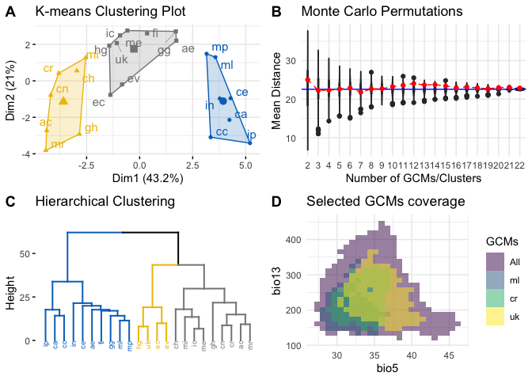
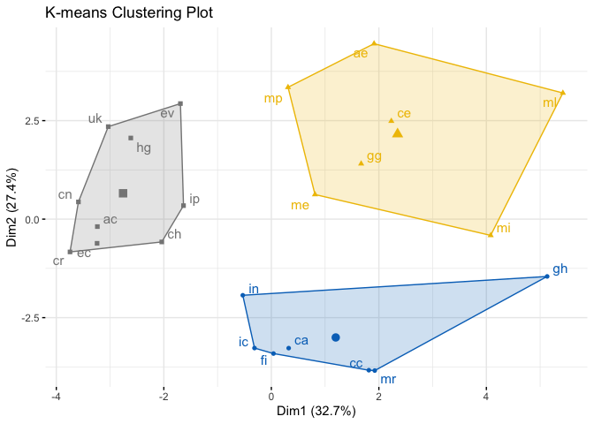

<!-- README.md is generated from README.Rmd. Please edit that file -->

# chooseGCM: an R package with a toolkit to select General Circulation Models

<!-- badges: start -->
<!-- badges: end -->

The goal of chooseGCM is to help researchers aiming to project Species
Distribution Models and Ecological Niche Models to future scenarios by
applying a selection routine to the General Circulation Models.

## Installation

You can install the development version of chooseGCM from
[GitHub](https://github.com/) with:

``` r
install.packages("devtools")
devtools::install_github("luizesser/chooseGCM")
```

## Tutorial

This is a basic tutorial which shows you how to use the functions in
chooseGCM. After installing the package, we need to open it:

``` r
library(chooseGCM)
#> Warning: replacing previous import 'dplyr::union' by 'raster::union' when
#> loading 'chooseGCM'
#> Warning: replacing previous import 'dplyr::intersect' by 'raster::intersect'
#> when loading 'chooseGCM'
#> Warning: replacing previous import 'ggpubr::rotate' by 'raster::rotate' when
#> loading 'chooseGCM'
#> Warning: replacing previous import 'dplyr::select' by 'raster::select' when
#> loading 'chooseGCM'
#> Warning: replacing previous import 'raster::predict' by 'stats::predict' when
#> loading 'chooseGCM'
#> Warning: replacing previous import 'dplyr::lag' by 'stats::lag' when loading
#> 'chooseGCM'
#> Warning: replacing previous import 'raster::quantile' by 'stats::quantile' when
#> loading 'chooseGCM'
#> Warning: replacing previous import 'dplyr::filter' by 'stats::filter' when
#> loading 'chooseGCM'
#> Warning: replacing previous import 'raster::aggregate' by 'stats::aggregate'
#> when loading 'chooseGCM'
#> Warning: replacing previous import 'raster::weighted.mean' by
#> 'stats::weighted.mean' when loading 'chooseGCM'
#> Warning: replacing previous import 'raster::density' by 'stats::density' when
#> loading 'chooseGCM'
#> Warning: replacing previous import 'raster::update' by 'stats::update' when
#> loading 'chooseGCM'
#> Warning: replacing previous import 'raster::tail' by 'utils::tail' when loading
#> 'chooseGCM'
#> Warning: replacing previous import 'raster::stack' by 'utils::stack' when
#> loading 'chooseGCM'
#> Warning: replacing previous import 'raster::head' by 'utils::head' when loading
#> 'chooseGCM'
#> Warning: replacing previous import 'raster::unstack' by 'utils::unstack' when
#> loading 'chooseGCM'
```

### Downloading WorldClim 2.1 Data

First, we need to use only one time period. Here we use 2090 so the
difference between models is more conspicuous. In the same way we are
considering the SSP585, which is the more dramatic pathway. The
resolution is the lowest to be quicker. The aim here is to maintain all
parameters equal, but General Circulation Models (GCMs). In this way we
know that the only source of variation comes from them. Note that if you
receive a timeout error you can increase timeout value by running ,
where 600 is the value in seconds that will be enough to download the
data.

``` r
WorldClim_data(period = 'future', variable = 'bioc', year = '2090', gcm = 'all', ssp = '585', resolution = 10)
```

### Importing and Transforming Data

Now let’s import GCMs to R in a list of stacks and name the list with
the names of the GCMs.

``` r
s <- import_gcms()
names(s) <- gsub("_ssp585_10_2090","",names(s))
```

In each function, data will be transformed. To do that you will always
need to provide at least: (1) the list of stacks, (2) the variables you
want to use in analysis and (3) the shapefile of your study area. You
don’t need to previously mask and subset your data, once the functions
will perform this task internally for you. Note that the results from
these functions are highly sensitive to variables and to study area. In
this sense, the decision on what variables should be considered and what
is the study area must be carefully made considering biological aspects
of the studied group.

``` r
var_names <- c('bio_5', 'bio_13','bio_15')
study_area_parana <- sf::st_read('input_data/PR_UF_2022.shp')
```

### Straigthforward Approach

There is the option to run each function in separate to better
understand what is happening and to better parameterize each step.
However there is a wrapper to help run everything at once and could be
an alternative to have a broad perspective. `compare_gcms()` will return
a list with a vector called `suggested_gcms` and a Figure called
`statistics_gcms`. We suggest that this Figure could also be included as
it is in supplementary data from studies using this package.

``` r
res <- compare_gcms(s, var_names, study_area_parana, k = 3)
#> Warning: The `<scale>` argument of `guides()` cannot be `FALSE`. Use "none" instead as
#> of ggplot2 3.3.4.
#> ℹ The deprecated feature was likely used in the factoextra package.
#>   Please report the issue at <https://github.com/kassambara/factoextra/issues>.
#> This warning is displayed once every 8 hours.
#> Call `lifecycle::last_lifecycle_warnings()` to see where this warning was
#> generated.
res$statistics_gcms
```



The aim of this function is to inform the minimum required so users can
follow with their workflow in a more straightforward fashion (more on
each plot further). If we see the D plot in the Figure, we can infer if
the selected GCMs encompass the environmental variety of all GCMs. The
focus should be to cover the core environment and not outlier regions on
the environmental space. Above that, in plot B, the Monte Carlo
permutation between GCMs is presented as a violin plot. Plots A and C
are both clusterization methods that can be used to select GCMs.
Clusterization will be adapted to the number of clusters `k` designated
in the function. Lastly, suggested GCMs were “uk”, “ml” and “ac”. Those
suggestions are the gcms that are closer to the centroid of each K-means
cluster, thus they better represent the variation within each cluster.

### Deep-dive Approach

As an alternative for experienced modelers that want to deeply
understand the impacts of decisions on GCMs selection, we prepared a set
of functions to analyze data more carefully. Each function in the
wrapper mentioned above is available to be explored as stand-alone,
ranging from exploratory analysis to cluster analysis and methods to
determine the optimum number of clusters.

#### Exploratory Analysis

In chooseGCM we implemented functions to analyze GCMs attributes.
`summary_gcms` is the only function available that describes variations
within GCMs. It returns the internal information regarding each
variable, as reads: minimum value (min), first quartile (quantile_0.25),
second quartile (median), average (mean), third quartile
(quantile_0.75), maximum value (max), standard deviation (sd), number of
NAs (NAs) and the total number of cells (n_cells). This function returns
a list of GCMs with a table associated with each of them.

``` r
# Summary of GCMs
s_sum <- summary_gcms(s, var_names, study_area_parana)
s_sum
#> $ac
#>              min quantile_0.25    median      mean quantile_0.75       max
#> bio_5   30.26061      33.01390  35.02451  34.80212      36.42513  38.40598
#> bio_13 224.12063     282.74970 313.23091 324.24229     368.32585 442.13201
#> bio_15  21.40317      31.66128  36.05844  35.76401      39.83684  52.37042
#>               sd NAs n_cells
#> bio_5   1.984392 343     975
#> bio_13 49.323508 343     975
#> bio_15  6.124250 343     975
#> 
#> $ae
#>              min quantile_0.25    median      mean quantile_0.75       max
#> bio_5   28.72171      31.64461  33.82813  33.70744      35.54123  38.52787
#> bio_13 164.11662     206.36238 234.51909 231.88477     253.38022 340.26649
#> bio_15  14.10353      23.27106  26.92607  27.71403      32.05736  48.57550
#>               sd NAs n_cells
#> bio_5   2.341817 343     975
#> bio_13 32.920944 343     975
#> bio_15  6.629614 343     975
#> 
#> $ca
#>              min quantile_0.25    median      mean quantile_0.75       max
#> bio_5   32.62990      36.49244  39.98461  39.63354      42.59414  45.46806
#> bio_13 134.25184     160.69164 177.39474 180.04803     195.73812 252.99690
#> bio_15  26.38048      35.63326  41.19924  41.31525      46.43239  61.80791
#>               sd NAs n_cells
#> bio_5   3.405290 343     975
#> bio_13 24.086040 343     975
#> bio_15  7.466578 343     975
#> 
#> $cc
#>              min quantile_0.25    median      mean quantile_0.75       max
#> bio_5   32.86076      36.94869  40.39324  40.11279      43.12089  45.93269
#> bio_13 132.89175     163.38650 175.39422 179.95447     192.31163 249.38172
#> bio_15  26.39760      36.50399  41.36431  41.70356      46.65127  62.98824
#>               sd NAs n_cells
#> bio_5   3.468721 343     975
#> bio_13 22.023718 343     975
#> bio_15  7.492665 343     975
#> 
#> $ce
#>              min quantile_0.25    median      mean quantile_0.75       max
#> bio_5   28.49086      30.90774  33.32123  33.08078      34.98518  37.23296
#> bio_13 160.09206     188.54479 207.32792 209.78494     226.39106 346.90099
#> bio_15  22.64219      30.51760  34.49656  35.52471      39.34769  59.90047
#>               sd NAs n_cells
#> bio_5   2.303271 343     975
#> bio_13 28.984064 343     975
#> bio_15  7.128410 343     975
#> 
#> $ch
#>              min quantile_0.25    median      mean quantile_0.75       max
#> bio_5   30.29526      32.71605  35.01514  34.73141      36.57695  38.06917
#> bio_13 161.80281     198.74798 226.59591 233.75398     262.41017 332.11823
#> bio_15  22.31555      29.53830  33.89825  33.87370      37.33222  49.77581
#>               sd NAs n_cells
#> bio_5   2.159323 343     975
#> bio_13 41.414470 343     975
#> bio_15  5.503135 343     975
#> 
#> $cn
#>              min quantile_0.25    median      mean quantile_0.75       max
#> bio_5   29.83416      32.23992  34.13371  33.98563       35.6433  37.27494
#> bio_13 163.08033     203.04138 231.56849 243.36138      282.9891 360.52124
#> bio_15  21.91490      29.17356  33.61836  33.57262       37.3163  48.95621
#>               sd NAs n_cells
#> bio_5   1.940772 343     975
#> bio_13 49.210449 343     975
#> bio_15  5.383665 343     975
#> 
#> $cr
#>              min quantile_0.25    median      mean quantile_0.75       max
#> bio_5   29.73416      32.12476  33.76563  33.70309      35.23139  37.00658
#> bio_13 165.68021     198.03851 224.10872 229.39616     257.07826 319.60043
#> bio_15  18.27380      27.51016  32.76278  32.90503      37.67608  50.93997
#>               sd NAs n_cells
#> bio_5   1.800216 343     975
#> bio_13 37.532586 343     975
#> bio_15  6.818873 343     975
#> 
#> $ec
#>              min quantile_0.25    median      mean quantile_0.75       max
#> bio_5   28.05644      30.52174  33.39316  33.62745      36.40044  40.06277
#> bio_13 153.43311     191.60708 220.34475 222.27008     248.99831 323.45767
#> bio_15  23.85794      29.93092  32.78896  33.47820      37.01114  47.53911
#>               sd NAs n_cells
#> bio_5   3.256466 343     975
#> bio_13 36.560327 343     975
#> bio_15  4.603615 343     975
#> 
#> $ev
#>              min quantile_0.25    median      mean quantile_0.75       max
#> bio_5   28.29086      30.87917  34.06034  34.08671      36.90689  40.53250
#> bio_13 145.59344     180.00812 201.42543 207.51134     230.57723 334.26770
#> bio_15  24.86201      30.28744  33.70015  34.34216      37.43661  50.58348
#>               sd NAs n_cells
#> bio_5   3.359603 343     975
#> bio_13 35.548106 343     975
#> bio_15  4.857611 343     975
#> 
#> $fi
#>              min quantile_0.25    median      mean quantile_0.75       max
#> bio_5   29.01210      31.84949  33.83313  33.64331      35.26741  37.84391
#> bio_13 174.65593     201.64553 219.94507 225.18894     251.17838 314.61781
#> bio_15  19.08621      25.87605  29.58721  30.32712      33.61018  51.10931
#>               sd NAs n_cells
#> bio_5   2.023927 343     975
#> bio_13 30.105078 343     975
#> bio_15  6.063165 343     975
#> 
#> $gg
#>              min quantile_0.25    median      mean quantile_0.75       max
#> bio_5   28.35196      30.77980  32.79452  32.60924      34.28063  36.15628
#> bio_13 153.75514     176.61163 196.54703 196.33973     212.15815 296.91739
#> bio_15  11.78741      19.03363  22.44540  23.67124      27.45332  45.49844
#>               sd NAs n_cells
#> bio_5   2.004696 343     975
#> bio_13 23.249518 343     975
#> bio_15  6.517065 343     975
#> 
#> $gh
#>              min quantile_0.25    median      mean quantile_0.75       max
#> bio_5   28.21731      30.68337  32.73374  32.60451      34.37039  36.18172
#> bio_13 147.10829     181.80839 208.58071 209.69143     237.33228 282.34803
#> bio_15  19.85593      25.70747  28.00496  29.27738      32.68606  48.97674
#>               sd NAs n_cells
#> bio_5   2.117708 343     975
#> bio_13 30.789909 343     975
#> bio_15  5.440492 343     975
#> 
#> $hg
#>              min quantile_0.25    median      mean quantile_0.75       max
#> bio_5   31.13856      34.42890  36.70430  36.47516      38.43256  40.57494
#> bio_13 169.04159     213.45747 236.87317 244.27400     275.88901 354.59307
#> bio_15  15.53709      23.15852  27.00961  27.76471      31.46548  46.62684
#>               sd NAs n_cells
#> bio_5   2.310044 343     975
#> bio_13 40.251235 343     975
#> bio_15  6.005802 343     975
#> 
#> $ic
#>              min quantile_0.25    median      mean quantile_0.75       max
#> bio_5   28.70776      30.79083  32.44845  32.34917      33.80908  35.87494
#> bio_13 147.30466     171.06382 186.87254 193.35761     212.68533 288.32870
#> bio_15  14.58007      24.16027  27.83976  28.68280      32.59996  49.03214
#>               sd NAs n_cells
#> bio_5   1.811552 343     975
#> bio_13 28.012579 343     975
#> bio_15  6.635170 343     975
#> 
#> $`in`
#>              min quantile_0.25    median      mean quantile_0.75       max
#> bio_5   28.72848      30.82765  32.41980  32.40730      33.80212  36.47494
#> bio_13 161.52419     185.46827 199.54241 202.64082     214.50042 351.75621
#> bio_15  14.65916      23.77119  27.98068  28.64915      32.95829  50.70791
#>               sd NAs n_cells
#> bio_5   1.830847 343     975
#> bio_13 24.217670 343     975
#> bio_15  7.375416 343     975
#> 
#> $ip
#>              min quantile_0.25    median      mean quantile_0.75       max
#> bio_5   29.73416      32.68782  35.77748  35.48970      37.91489  40.41699
#> bio_13 159.56344     181.32766 195.05749 197.40103     211.32161 284.26690
#> bio_15  16.00507      26.77708  32.80609  33.31139      39.05771  60.27994
#>               sd NAs n_cells
#> bio_5   2.901743 343     975
#> bio_13 20.271548 343     975
#> bio_15  9.020713 343     975
#> 
#> $me
#>              min quantile_0.25    median      mean quantile_0.75       max
#> bio_5   27.62848      29.58797  31.27632  31.26874      32.73183  34.80598
#> bio_13 156.52474     179.48378 199.96653 204.79726     226.42528 297.73651
#> bio_15  16.15398      26.19266  28.80313  29.72263      33.38585  49.10374
#>               sd NAs n_cells
#> bio_5   1.837425 343     975
#> bio_13 29.107648 343     975
#> bio_15  6.231605 343     975
#> 
#> $mi
#>              min quantile_0.25    median      mean quantile_0.75       max
#> bio_5   29.78985      32.06696  32.97152  33.02705      34.02152  36.42464
#> bio_13 161.00713     191.65730 209.20822 215.86132     239.70697 307.64819
#> bio_15  16.95916      26.03894  29.28605  29.57971      32.96107  43.80171
#>               sd NAs n_cells
#> bio_5   1.402383 343     975
#> bio_13 29.770515 343     975
#> bio_15  5.266897 343     975
#> 
#> $ml
#>              min quantile_0.25    median      mean quantile_0.75       max
#> bio_5   28.50776      30.50234  32.24707  32.18487      33.70495  36.34391
#> bio_13 148.63551     173.25150 188.91330 189.76359     202.15102 312.62540
#> bio_15  18.31306      28.64226  32.92004  34.05128      39.09806  57.43911
#>               sd NAs n_cells
#> bio_5   1.888484 343     975
#> bio_13 23.275037 343     975
#> bio_15  8.098461 343     975
#> 
#> $mp
#>              min quantile_0.25    median      mean quantile_0.75       max
#> bio_5   28.37438      30.29746  31.96719  31.93173      33.45840  35.55591
#> bio_13 156.99983     190.47906 208.26453 210.06902     228.44029 301.85869
#> bio_15  15.56945      25.51134  29.19092  30.75855      35.40487  52.80058
#>               sd NAs n_cells
#> bio_5   1.866198 343     975
#> bio_13 27.141968 343     975
#> bio_15  7.543110 343     975
#> 
#> $mr
#>              min quantile_0.25    median      mean quantile_0.75       max
#> bio_5   28.09086      30.35537  32.03033  31.89886      33.33648  35.64391
#> bio_13 168.56911     211.65106 243.65130 245.46815     277.43495 325.04975
#> bio_15  19.00734      26.82087  32.25545  32.05659      36.88110  50.29647
#>               sd NAs n_cells
#> bio_5   1.751161 343     975
#> bio_13 37.353812 343     975
#> bio_15  6.804995 343     975
#> 
#> $uk
#>              min quantile_0.25    median      mean quantile_0.75       max
#> bio_5   31.22171      34.10035  36.20007  36.21587      38.23228  41.14654
#> bio_13 157.72174     200.08367 228.58700 234.20227     265.91798 350.73710
#> bio_15  17.88849      25.91104  30.26981  30.59170      34.71065  47.98321
#>               sd NAs n_cells
#> bio_5   2.404882 343     975
#> bio_13 42.730072 343     975
#> bio_15  6.175806 343     975
```

Regarding the exploratory comparison between GCMs, two functions are
available: `cor_gcms` and `dist_gcms`. The first is designed to return a
list with a correlation matrix between GCMs and a plot of this matrix.
We noticed while building this package that (as expected) Pearson
correlation values are always very high, rarely reaching values bellow
0.95. In this way we found that this function could not be so
informative and decided to present a distance function as seen bellow.
However it is noteworthy that through this function the user can change
the method used to obtain correlation values. See `?cor_gcms` for
available methods.

``` r
# Pearson Correlation between GCMs
s_cor <- cor_gcms(s, var_names, study_area_parana, method = "pearson")
s_cor
#> $cor_matrix
#>           ac        ae        ca        cc        ce        ch        cn
#> ac 1.0000000 0.8168457 0.7377052 0.7699584 0.7123809 0.9260965 0.9730326
#> ae 0.8168457 1.0000000 0.9111641 0.8701274 0.9087373 0.8950387 0.8602279
#> ca 0.7377052 0.9111641 1.0000000 0.9529991 0.9185688 0.8071467 0.7644214
#> cc 0.7699584 0.8701274 0.9529991 1.0000000 0.8795839 0.8179988 0.7960723
#> ce 0.7123809 0.9087373 0.9185688 0.8795839 1.0000000 0.8352246 0.7633085
#> ch 0.9260965 0.8950387 0.8071467 0.8179988 0.8352246 1.0000000 0.9456752
#> cn 0.9730326 0.8602279 0.7644214 0.7960723 0.7633085 0.9456752 1.0000000
#> cr 0.9698425 0.8823095 0.8092755 0.8345769 0.7987614 0.9625161 0.9819558
#> ec 0.8422210 0.9178961 0.8103145 0.7971072 0.8113835 0.9032865 0.8776732
#> ev 0.8296694 0.9118506 0.8285572 0.8262468 0.8468423 0.9095587 0.8815798
#> fi 0.8586389 0.9217809 0.8727985 0.8661485 0.9061916 0.9096782 0.8969811
#> gg 0.8331262 0.9482198 0.8916034 0.8725616 0.9269122 0.8965138 0.8707006
#> gh 0.9083067 0.8235925 0.7446238 0.7655103 0.7284009 0.8769268 0.9105517
#> hg 0.8841268 0.9300254 0.8297376 0.8188666 0.8283096 0.9128693 0.9092986
#> ic 0.8998764 0.9209997 0.8800967 0.8789368 0.8799301 0.9481856 0.9259315
#> in 0.7170504 0.8942162 0.8614722 0.8742621 0.9051239 0.8129592 0.7650999
#> ip 0.6660920 0.8976136 0.9467857 0.9233185 0.9033274 0.7492696 0.6969025
#> me 0.8851458 0.9325317 0.8735989 0.8662006 0.8753405 0.9330303 0.9160118
#> mi 0.9316105 0.8946993 0.8115822 0.8254643 0.8139785 0.9415960 0.9401168
#> ml 0.7721328 0.9334139 0.9026873 0.8803522 0.9374324 0.8524023 0.8106532
#> mp 0.7888471 0.9486767 0.9236568 0.8726720 0.9367250 0.8627422 0.8257242
#> mr 0.9797531 0.7786801 0.7106341 0.7524977 0.6807161 0.9101279 0.9536606
#> uk 0.8685524 0.9426546 0.8601004 0.8417883 0.8437744 0.9204922 0.8997568
#>           cr        ec        ev        fi        gg        gh        hg
#> ac 0.9698425 0.8422210 0.8296694 0.8586389 0.8331262 0.9083067 0.8841268
#> ae 0.8823095 0.9178961 0.9118506 0.9217809 0.9482198 0.8235925 0.9300254
#> ca 0.8092755 0.8103145 0.8285572 0.8727985 0.8916034 0.7446238 0.8297376
#> cc 0.8345769 0.7971072 0.8262468 0.8661485 0.8725616 0.7655103 0.8188666
#> ce 0.7987614 0.8113835 0.8468423 0.9061916 0.9269122 0.7284009 0.8283096
#> ch 0.9625161 0.9032865 0.9095587 0.9096782 0.8965138 0.8769268 0.9128693
#> cn 0.9819558 0.8776732 0.8815798 0.8969811 0.8707006 0.9105517 0.9092986
#> cr 1.0000000 0.8804530 0.8794786 0.9118943 0.9074008 0.9163500 0.9164136
#> ec 0.8804530 1.0000000 0.9769926 0.8907992 0.8628081 0.8313826 0.9417478
#> ev 0.8794786 0.9769926 1.0000000 0.9126548 0.8781098 0.8151110 0.9467112
#> fi 0.9118943 0.8907992 0.9126548 1.0000000 0.9538430 0.8706235 0.9527152
#> gg 0.9074008 0.8628081 0.8781098 0.9538430 1.0000000 0.8754215 0.9113567
#> gh 0.9163500 0.8313826 0.8151110 0.8706235 0.8754215 1.0000000 0.8670281
#> hg 0.9164136 0.9417478 0.9467112 0.9527152 0.9113567 0.8670281 1.0000000
#> ic 0.9544140 0.8542169 0.8733282 0.9321585 0.9472424 0.8615123 0.9096903
#> in 0.8086542 0.7657924 0.7981165 0.8842709 0.9293609 0.7204413 0.8320453
#> ip 0.7523479 0.7665815 0.7850480 0.8305166 0.8896283 0.7092065 0.7856322
#> me 0.9437898 0.8564719 0.8675465 0.9282559 0.9565043 0.8706964 0.9122721
#> mi 0.9680010 0.8700903 0.8720177 0.9161966 0.9222395 0.8720106 0.9228911
#> ml 0.8535342 0.8203916 0.8476937 0.9307982 0.9685639 0.8027943 0.8792123
#> mp 0.8553100 0.8362250 0.8552786 0.9428780 0.9497788 0.8110272 0.8935274
#> mr 0.9640562 0.8095983 0.7981135 0.8410090 0.8210487 0.9288927 0.8555727
#> uk 0.9139330 0.9531678 0.9622447 0.9360413 0.9068641 0.8348837 0.9845585
#>           ic        in        ip        me        mi        ml        mp
#> ac 0.8998764 0.7170504 0.6660920 0.8851458 0.9316105 0.7721328 0.7888471
#> ae 0.9209997 0.8942162 0.8976136 0.9325317 0.8946993 0.9334139 0.9486767
#> ca 0.8800967 0.8614722 0.9467857 0.8735989 0.8115822 0.9026873 0.9236568
#> cc 0.8789368 0.8742621 0.9233185 0.8662006 0.8254643 0.8803522 0.8726720
#> ce 0.8799301 0.9051239 0.9033274 0.8753405 0.8139785 0.9374324 0.9367250
#> ch 0.9481856 0.8129592 0.7492696 0.9330303 0.9415960 0.8524023 0.8627422
#> cn 0.9259315 0.7650999 0.6969025 0.9160118 0.9401168 0.8106532 0.8257242
#> cr 0.9544140 0.8086542 0.7523479 0.9437898 0.9680010 0.8535342 0.8553100
#> ec 0.8542169 0.7657924 0.7665815 0.8564719 0.8700903 0.8203916 0.8362250
#> ev 0.8733282 0.7981165 0.7850480 0.8675465 0.8720177 0.8476937 0.8552786
#> fi 0.9321585 0.8842709 0.8305166 0.9282559 0.9161966 0.9307982 0.9428780
#> gg 0.9472424 0.9293609 0.8896283 0.9565043 0.9222395 0.9685639 0.9497788
#> gh 0.8615123 0.7204413 0.7092065 0.8706964 0.8720106 0.8027943 0.8110272
#> hg 0.9096903 0.8320453 0.7856322 0.9122721 0.9228911 0.8792123 0.8935274
#> ic 1.0000000 0.9026653 0.8307098 0.9895197 0.9666579 0.9193685 0.9174823
#> in 0.9026653 1.0000000 0.9034021 0.9105777 0.8679108 0.9562031 0.9111128
#> ip 0.8307098 0.9034021 1.0000000 0.8359167 0.7699188 0.9195820 0.9023435
#> me 0.9895197 0.9105777 0.8359167 1.0000000 0.9648281 0.9309497 0.9236060
#> mi 0.9666579 0.8679108 0.7699188 0.9648281 1.0000000 0.8895426 0.8761040
#> ml 0.9193685 0.9562031 0.9195820 0.9309497 0.8895426 1.0000000 0.9720941
#> mp 0.9174823 0.9111128 0.9023435 0.9236060 0.8761040 0.9720941 1.0000000
#> mr 0.8838154 0.7006355 0.6548661 0.8648326 0.9171438 0.7586856 0.7646548
#> uk 0.9210851 0.8390862 0.8073069 0.9226813 0.9231350 0.8840019 0.8962334
#>           mr        uk
#> ac 0.9797531 0.8685524
#> ae 0.7786801 0.9426546
#> ca 0.7106341 0.8601004
#> cc 0.7524977 0.8417883
#> ce 0.6807161 0.8437744
#> ch 0.9101279 0.9204922
#> cn 0.9536606 0.8997568
#> cr 0.9640562 0.9139330
#> ec 0.8095983 0.9531678
#> ev 0.7981135 0.9622447
#> fi 0.8410090 0.9360413
#> gg 0.8210487 0.9068641
#> gh 0.9288927 0.8348837
#> hg 0.8555727 0.9845585
#> ic 0.8838154 0.9210851
#> in 0.7006355 0.8390862
#> ip 0.6548661 0.8073069
#> me 0.8648326 0.9226813
#> mi 0.9171438 0.9231350
#> ml 0.7586856 0.8840019
#> mp 0.7646548 0.8962334
#> mr 1.0000000 0.8359830
#> uk 0.8359830 1.0000000
#> 
#> $cor_plot
```



The function `dist_gcms` is very similar to the previous `cor_gcms`, but
now for distances. This function has the same output: a list with two
slots. One is the distance matrix obtained (`distances`), while the
second is the plotted matrix (`heatmap`). Here the differences between
GCMs are way more clear than in the previous plot. As in was it the
previous function, methods can also be changed for a number of different
distances. For a complete list of available methods see `?dist_gcms`. To
build a distance matrix considering multiple variables to each GCM we
use a flattening strategy, where values are concatenated in one unique
vector to each GCM. In the process, we need to scale variables so they
end up with the same measure. This matrix is also used to calculate the
clusters in the `compare_gcms` function and in further presented
`kmeans_gcms` function.

``` r
# Euclidean Distance between GCMs
s_dist <- dist_gcms(s, var_names, study_area_parana, method = "euclidean")
s_dist
#> $distances
#>           ac        ae        ca        cc        ce        ch        cn
#> ae 32.707143                                                            
#> ca 39.140733 22.778667                                                  
#> cc 36.655338 27.541831 16.568653                                        
#> ce 40.986695 23.087698 21.808682 26.520177                              
#> ch 20.776218 24.759889 33.561982 32.604027 31.022743                    
#> cn 12.550275 28.572241 37.093854 34.512167 37.181369 17.812842          
#> cr 13.271861 26.218311 33.376232 31.083663 34.283861 14.796420 10.266041
#> ec 30.356987 21.898581 33.285196 34.424478 33.191273 23.767179 26.729749
#> ev 31.541357 22.690485 31.644171 31.856679 29.909107 22.983571 26.299469
#> fi 28.734191 21.374236 27.257134 27.960549 23.407494 22.968385 24.529719
#> gg 31.219657 17.390653 25.161810 27.282500 20.661243 24.585292 27.480983
#> gh 23.142104 32.099077 38.621068 37.008030 39.828890 26.811169 22.857050
#> hg 26.015100 20.216424 31.535047 32.526201 31.667009 22.558990 23.016600
#> ic 24.182563 21.480697 26.463647 26.591332 26.482020 17.396390 20.799399
#> in 40.652630 24.856716 28.444774 27.099869 23.540331 33.052339 37.040401
#> ip 44.161876 24.454303 17.629827 21.163098 23.762147 38.268161 42.075108
#> me 25.900459 19.851066 27.171245 27.955108 26.983401 19.777581 22.148444
#> mi 19.986133 24.799888 33.173783 31.928332 32.962154 18.469508 18.701929
#> ml 36.481694 19.720864 23.840688 26.435429 19.116512 29.361207 33.255472
#> mp 35.118232 17.313755 21.116365 27.270680 19.224281 28.314093 31.904550
#> mr 10.874614 35.953761 41.110974 38.021017 43.183969 22.911124 16.451637
#> uk 27.708338 18.301361 28.585272 30.398584 30.207183 21.549593 24.197000
#>           cr        ec        ev        fi        gg        gh        hg
#> ae                                                                      
#> ca                                                                      
#> cc                                                                      
#> ce                                                                      
#> ch                                                                      
#> cn                                                                      
#> cr                                                                      
#> ec 26.424293                                                            
#> ev 26.531761 11.592261                                                  
#> fi 22.684854 25.254976 22.586742                                        
#> gg 23.256148 28.307286 26.682004 16.419229                              
#> gh 22.103808 31.382339 32.861665 27.489182 26.974635                    
#> hg 22.095405 18.445491 17.642174 16.618616 22.753968 27.868529          
#> ic 16.317359 29.180164 27.200317 19.905906 17.554017 28.440657 22.966844
#> in 33.430555 36.985765 34.338754 25.998918 20.312187 40.408297 31.320608
#> ip 38.032516 36.923401 35.432744 31.462823 25.390012 41.212262 35.384566
#> me 18.119307 28.953603 27.814148 20.470443 15.938862 27.481428 22.636169
#> mi 13.671067 27.545767 27.340666 22.124063 21.311478 27.341426 21.221997
#> ml 29.248404 32.388987 29.825864 20.104477 13.550292 33.938592 26.561064
#> mp 29.070560 30.928430 29.073712 18.265674 17.126848 33.222605 24.937510
#> mr 14.489262 33.347980 34.339007 30.473361 32.329691 20.379388 29.044149
#> uk 22.420862 16.538897 14.849889 19.327865 23.323446 31.054825  9.496830
#>           ic        in        ip        me        mi        ml        mp
#> ae                                                                      
#> ca                                                                      
#> cc                                                                      
#> ce                                                                      
#> ch                                                                      
#> cn                                                                      
#> cr                                                                      
#> ec                                                                      
#> ev                                                                      
#> fi                                                                      
#> gg                                                                      
#> gh                                                                      
#> hg                                                                      
#> ic                                                                      
#> in 23.843387                                                            
#> ip 31.444883 23.752966                                                  
#> me  7.823842 22.853730 30.957526                                        
#> mi 13.955031 27.775869 36.658497 14.332823                              
#> ml 21.701338 15.993958 21.672581 20.082460 25.399872                    
#> mp 21.953689 22.785241 23.882772 21.123389 26.900647 12.766792          
#> mr 26.050032 41.815202 44.898091 28.097650 21.998679 37.542716 37.075480
#> uk 21.469092 30.657076 33.548042 21.250854 21.188415 26.029118 24.618572
#>           mr
#> ae          
#> ca          
#> cc          
#> ce          
#> ch          
#> cn          
#> cr          
#> ec          
#> ev          
#> fi          
#> gg          
#> gh          
#> hg          
#> ic          
#> in          
#> ip          
#> me          
#> mi          
#> ml          
#> mp          
#> mr          
#> uk 30.951276
#> 
#> $heatmap
```


#### Obtain Clusters

Clusters in chooseGCM are obtained through K-means, a unsupervised
machine learning algorithm. K in this case is the number of GCMs the
modeler wants to use in projections. As in the previous `dist_gcms`
function, we can address different methods to obtain the distance matrix
by changing the `method` argument. The K-means algorithm uses the
distance matrix to obtain clusters, thus a deep analysis of distances
using `dist_gcms` function could prove to be useful. As in
`compare_gcms` function, this function returns the K-means plot and a
set of suggested GCMs, i.e. the GCMs closer to the centroid of each
clusters.

``` r
kmeans_gcms(s, var_names, study_area_parana, k = 3,  method = "euclidean")
#> $suggested_gcms
#>    1    2    3 
#> "uk" "ac" "ml" 
#> 
#> $kmeans_plot
```


Alternatively, instead of using distances, one could run the analysis
with raw environmental data by not setting any value to method (note how
axis change). As in the previous case, the function also returns GCMs
that are closer to the centroids. Note however that the plot below has a
cluster with two GCMs, thus both have the same distance from the
centroid. In this case, the function randomly suggests one of them. To
perform this analysis without a distance matrix, we use only the mean
values of each variable selected. In this way, the variability within
variables is not considered, as in the above solution. But we recognize
that for some purpose it could be useful to have a plot with raw
variables as axis as provided here.

``` r
kmeans_gcms(s, var_names, study_area_parana, k = 3)
#> $suggested_gcms
#> [1] "ip" "ac" "uk"
#> 
#> $kmeans_plot
```


We can also obtain clusters through hierarchical clustering. In this
case, however, the function doesn’t suggest any GCM. It is up to the
user to define which GCMs are most suitable in this case. Hierarchical
clustering is useful to visually inform the relationship between groups
and could also be used to choose a number of clusters to build (together
with metrics in the next section).

``` r
hclust_gcms(s, var_names, study_area_parana, k = 3)
```


In this function we also provide a `n` argument to inform the amount of
data to be used in the clustering. This proved valuable when using high
resolution data.

``` r
hclust_gcms(s, var_names, study_area_parana, k = 3, n = 1000)
```


#### Number of Clusters

But how many clusters are good? There is three metrics implemented to
understand that. All of them are a way to see the minimum amount of GCMs
that are needed to encompass the variability in the whole set of GCMs.
The three methods are implemented in the same function by adjusting the
`method` argument. Within-cluster sum of squares (wss) calculates the
internal variability within clusters. Our goal here is to search for the
minimum amount of clusters that has the minimum amount of variability.
This is shown in the graph were the line changes abruptly its direction
(Number of clusters k = 3). As in the previous function, this function
provides a `n` argument to inform the amount of data to be used in the
clustering. Finally, one can also indicate the method to build clusters
with the argument `clusters`. Available methods are ‘kmeans’ (standard)
and ‘hclust’.

``` r
optk_gcms(s, var_names, study_area_parana, cluster = 'kmeans', method = 'wss', n = 1000)
```


The Average Silhouette Width method, measures the mean distance from all
individuals to the centroid of their own clusters, while comparing to
other clusters. This is sometimes also referred as a metric of cluster
quality (the higher the better). A number of clusters is the best when
the distance from individuals within the cluster to its centroid is
lower than the distance from individuals to other clusters centroid
(maximizing the average silhouette width). In this method, the best
number of clusters is marked with a dashed line (2 clusters).

``` r
optk_gcms(s, var_names, study_area_parana, cluster = 'kmeans', method = 'silhouette', n = 1000)
```


Our last method is the Gap Statistics. As in the previous method, here
the optimum number of clusters is showed with a dashed line (1 cluster).
This method compares the variation within clusters with a set of null
clusters build through Monte Carlo (“bootstrap”) sampling. Because of
that, the gap statistics can take a longer time to run when compared to
previous methods described here. Moreover, some parameters can be
changed to improve the Monte Carlo process, such as: `nstart`, `K.max`
and `B`, where `nstart` is the initial number of arrangements to be
compared, `K.max` is the maximum number of clusters to be created and B
is the number of bootstrap permutations.

``` r
optk_gcms(s, var_names, study_area_parana, cluster = 'kmeans', method = 'gap_stat', n = 1000)
#> Warning: did not converge in 10 iterations

#> Warning: did not converge in 10 iterations
```


#### Monte Carlo permutations

An alternative way to analyse if the mean distance between GCMs is
similar to the mean distance between all GCMs is to use the
`montecarlo_gcms` function. This function will build a distance matrix
(using `method` argument) and plot the mean distance between all GCMs as
a blue line. Afterwards, it will run a Monte Carlo permutation to
randomly choose a group size ranging from \[2\] and \[total number of
GCMs - 1\] and randomly choose a subset of GCMs with that group size.
The mean distance between the random set is obtained and ploted in a
violin plot. Finally, the function accesses the mean distance between
selected GCMs using the kmeans function in all possible values of `k`
and plots it in red.

``` r
montecarlo_gcms(s, var_names, study_area_parana, perm = 10000, method='euclidean')
#> $montecarlo_plot
```


#### The environment covered by GCMs selection

We also included in this package a function called `env_gcms`, which is
able to project GCMs in the environmental space. With that, researchers
are able to see the coverage of GCMs when comparing to all GCMs. It is
also possible to see the density of GCMs using the `highlight=sum` as
argument.

``` r
env_gcms(s, var_names, study_area_parana, highlight=res$suggested_gcms)
```


``` r
env_gcms(s, var_names, study_area_parana, highlight='sum')
```


#### Wrapping Up

From our analysis, we can infer that something between two and three
clusters is enough to inform regarding the environmental variation from
given GCMs. In this way, if we use GCMs CNRM-CM6-1 (cn), FIO-ESM-2-0
(fi) and MPI-ESM1-2-HR (mp) to project our models into future scenarios
we would be able to inform a decent variation in our projections.
