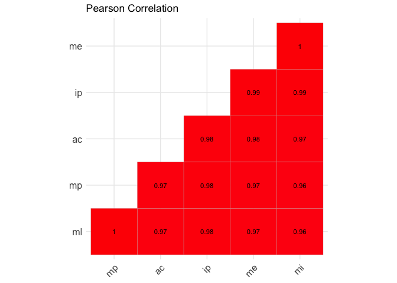
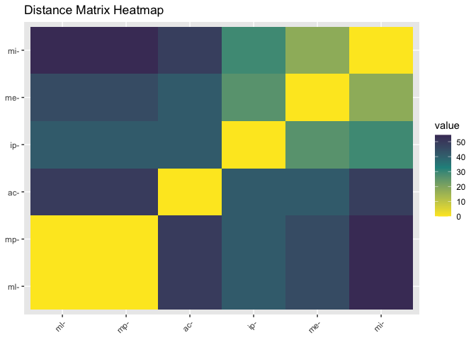
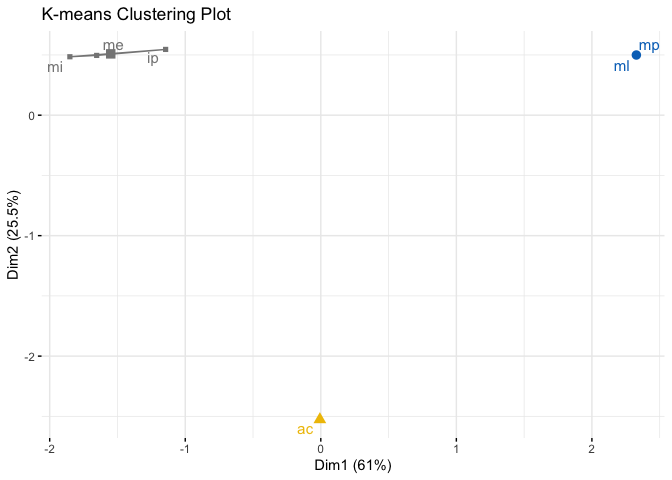
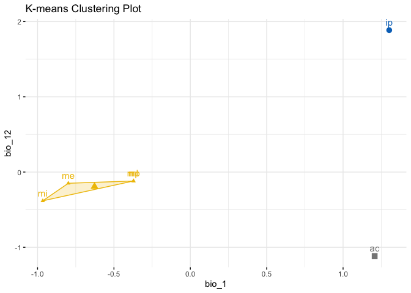
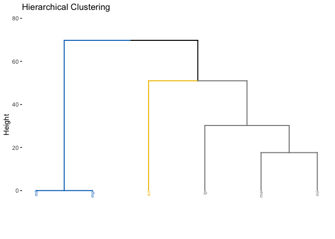
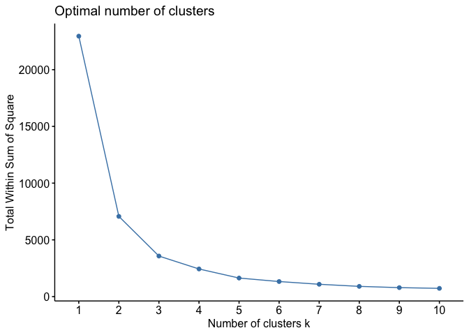
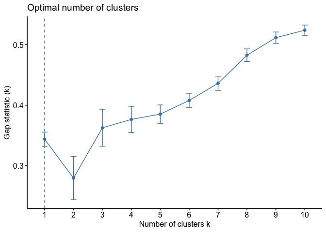
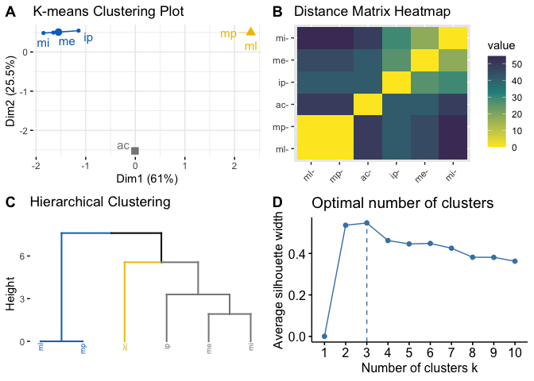

<!-- README.md is generated from README.Rmd. Please edit that file -->

# chooseGCM

<!-- badges: start -->
<!-- badges: end -->

The goal of chooseGCM is to help researchers aiming to project Species
Distribution Models and Ecological Niche Models to future scenarios by
applying a selection routine to the General Circulation Models.

## Installation

You can install the development version of chooseGCM from
[GitHub](https://github.com/) with:

``` r
# install.packages("devtools")
devtools::install_github("luizesser/chooseGCM")
```

## Tutorial

This is a basic tutorial which shows you how to use the functions in
chooseGCM. After installing the package, we need to open it:

``` r
library(chooseGCM)
#> The legacy packages maptools, rgdal, and rgeos, underpinning this package
#> will retire shortly. Please refer to R-spatial evolution reports on
#> https://r-spatial.org/r/2023/05/15/evolution4.html for details.
#> This package is now running under evolution status 0
```

### Downloading WorldClim 2.1 data

First, we need to use only one time period. Here we use 2090 so the
difference between models is more conspicuous. In the same way we are
considering the SSP585, which is the more dramatic pathway. The
resolution is the lowest to be quicker. The aim here is to maintain all
parameters equal, but General Circulation Models (GCMs). In this way we
know that the only source of variation comes from them. Note that if you
receive a timeout error you can increase timeout value by running ,
where 600 is the value in seconds that will be enough to download the
data.

``` r
WorldClim_data(period = 'future', variable = 'bioc', year = '2090', gcm = 'all', ssp = '585', resolution = 10)
#> [1] "The file for future scenario (input_data/WorldClim_data_future/ac_ssp585_10m_2090.tif) is already downloaded."
#> [1] "The file for future scenario (input_data/WorldClim_data_future/ae_ssp585_10m_2090.tif) is already downloaded."
#> [1] "bc_ssp585_10_2090"
#> [1] "The file for future scenario (input_data/WorldClim_data_future/ca_ssp585_10m_2090.tif) is already downloaded."
#> [1] "The file for future scenario (input_data/WorldClim_data_future/cc_ssp585_10m_2090.tif) is already downloaded."
#> [1] "The file for future scenario (input_data/WorldClim_data_future/ce_ssp585_10m_2090.tif) is already downloaded."
#> [1] "The file for future scenario (input_data/WorldClim_data_future/cn_ssp585_10m_2090.tif) is already downloaded."
#> [1] "The file for future scenario (input_data/WorldClim_data_future/ch_ssp585_10m_2090.tif) is already downloaded."
#> [1] "The file for future scenario (input_data/WorldClim_data_future/cr_ssp585_10m_2090.tif) is already downloaded."
#> [1] "The file for future scenario (input_data/WorldClim_data_future/ec_ssp585_10m_2090.tif) is already downloaded."
#> [1] "The file for future scenario (input_data/WorldClim_data_future/ev_ssp585_10m_2090.tif) is already downloaded."
#> [1] "The file for future scenario (input_data/WorldClim_data_future/fi_ssp585_10m_2090.tif) is already downloaded."
#> [1] "gf_ssp585_10_2090"
#> [1] "The file for future scenario (input_data/WorldClim_data_future/gg_ssp585_10m_2090.tif) is already downloaded."
#> [1] "The file for future scenario (input_data/WorldClim_data_future/gh_ssp585_10m_2090.tif) is already downloaded."
#> [1] "The file for future scenario (input_data/WorldClim_data_future/hg_ssp585_10m_2090.tif) is already downloaded."
#> [1] "The file for future scenario (input_data/WorldClim_data_future/in_ssp585_10m_2090.tif) is already downloaded."
#> [1] "The file for future scenario (input_data/WorldClim_data_future/ic_ssp585_10m_2090.tif) is already downloaded."
#> [1] "The file for future scenario (input_data/WorldClim_data_future/ip_ssp585_10m_2090.tif) is already downloaded."
#> [1] "The file for future scenario (input_data/WorldClim_data_future/me_ssp585_10m_2090.tif) is already downloaded."
#> [1] "The file for future scenario (input_data/WorldClim_data_future/mi_ssp585_10m_2090.tif) is already downloaded."
#> [1] "The file for future scenario (input_data/WorldClim_data_future/mp_ssp585_10m_2090.tif) is already downloaded."
#> [1] "The file for future scenario (input_data/WorldClim_data_future/ml_ssp585_10m_2090.tif) is already downloaded."
#> [1] "The file for future scenario (input_data/WorldClim_data_future/mr_ssp585_10m_2090.tif) is already downloaded."
#> [1] "The file for future scenario (input_data/WorldClim_data_future/uk_ssp585_10m_2090.tif) is already downloaded."
```

### Importing and transforming data

Now let’s import GCMs to R in a list of stacks and name the list with
the names of the GCMs.

``` r
s <- import_gcms()
names(s) <- gsub("_ssp585_10_2090","",names(s))
```

In each function, data will be transformed. To do that you will always
need to provide at least: (1) the list of stacks, (2) the variables you
want to use in analysis and (3) the shapefile of your study area. You
don’t need to mask and subset your data, once the functions will perform
this task internally for you. We will analyze data through this file in
two ways: the deep-dive and the straightforward approach. In the fist,
we will use Amazon river basin data to search for the optimal GCMs,
while in the second we will simply go directly to a wrapper provided by
the package.

``` r
var_names <- c('bio_1', 'bio_12')
study_area_amazon <- sf::st_read('input_data/study_area.shp')
#> Reading layer `study_area' from data source 
#>   `/Users/luizesser/Documents/GitHub/chooseGCM/input_data/study_area.shp' 
#>   using driver `ESRI Shapefile'
#> Simple feature collection with 64963 features and 1 field
#> Geometry type: POLYGON
#> Dimension:     XY
#> Bounding box:  xmin: -57 ymin: -48.03172 xmax: -21.986 ymax: -33
#> CRS:           NA
study_area_parana <- sf::st_read('input_data/PR_UF_2022.shp')
#> Reading layer `PR_UF_2022' from data source 
#>   `/Users/luizesser/Documents/GitHub/chooseGCM/input_data/PR_UF_2022.shp' 
#>   using driver `ESRI Shapefile'
#> Simple feature collection with 1 feature and 5 fields
#> Geometry type: MULTIPOLYGON
#> Dimension:     XY
#> Bounding box:  xmin: -54.62021 ymin: -26.71712 xmax: -48.02354 ymax: -22.5163
#> Geodetic CRS:  SIRGAS 2000
```

### Deep-dive Approach

#### Exploratory analysis

In chooseGCM we implemented functions to analyze GCMs attributes.

``` r
# Summary of GCMs
s_sum <- summary_gcms(s, var_names, study_area_parana)
s_sum
#> $ac
#>               min quantile_0.25     median       mean quantile_0.75       max
#> bio_1    21.14508      23.54352   25.14589   25.12582      26.60815   29.0213
#> bio_12 1539.07778    1925.11421 2120.09089 2165.71880    2449.27217 3022.1828
#>               sd NAs n_cells
#> bio_1    1.91897 343     975
#> bio_12 324.16532 343     975
#> 
#> $ae
#>               min quantile_0.25     median       mean quantile_0.75       max
#> bio_1    20.04508      22.44359   24.13763   24.20368      25.86679   28.4213
#> bio_12 1266.73259    1637.93649 1920.80042 1927.95770    2211.70121 2841.3917
#>                sd NAs n_cells
#> bio_1    2.069079 343     975
#> bio_12 358.917740 343     975
#> 
#> $ca
#>              min quantile_0.25     median       mean quantile_0.75       max
#> bio_1   23.40558       26.3161   28.23294   28.27556      30.17974   32.8213
#> bio_12 899.68501     1084.4185 1192.64135 1221.82621    1360.61316 1681.3625
#>               sd NAs n_cells
#> bio_1    2.34298 343     975
#> bio_12 176.89317 343     975
#> 
#> $cc
#>              min quantile_0.25     median       mean quantile_0.75        max
#> bio_1   23.32379      26.26251   28.10655   28.15277      30.04786   32.57067
#> bio_12 906.39579    1102.52552 1211.35149 1243.46104    1381.04214 1711.17612
#>              sd NAs n_cells
#> bio_1    2.3017 343     975
#> bio_12 181.1493 343     975
#> 
#> $ce
#>               min quantile_0.25     median       mean quantile_0.75       max
#> bio_1    20.25737      22.62989   24.22644   24.26034      25.81062   28.1213
#> bio_12 1203.78155    1431.10650 1546.86691 1579.45570    1719.06829 2254.9885
#>                sd NAs n_cells
#> bio_1    1.942915 343     975
#> bio_12 203.285021 343     975
#> 
#> $ch
#>               min quantile_0.25     median       mean quantile_0.75        max
#> bio_1    20.44508       23.0047   24.61729   24.66952       26.2492   28.65248
#> bio_12 1210.83558     1519.7170 1709.96748 1744.62106     1977.0541 2545.76045
#>                sd NAs n_cells
#> bio_1    1.973665 343     975
#> bio_12 292.055854 343     975
#> 
#> $cn
#>               min quantile_0.25     median       mean quantile_0.75        max
#> bio_1    20.38985      22.84281   24.46567   24.55035      26.16051   28.72787
#> bio_12 1230.73369    1559.29639 1752.87315 1777.80709    2012.74102 2476.79014
#>                sd NAs n_cells
#> bio_1    2.006711 343     975
#> bio_12 279.614234 343     975
#> 
#> $cr
#>               min quantile_0.25    median       mean quantile_0.75        max
#> bio_1    19.84508      22.13891   23.8269   23.88207      25.51904   28.05248
#> bio_12 1246.10219    1551.05309 1717.2211 1745.90335    1953.88687 2382.93237
#>                sd NAs n_cells
#> bio_1    2.007895 343     975
#> bio_12 251.524591 343     975
#> 
#> $ec
#>               min quantile_0.25    median      mean quantile_0.75       max
#> bio_1    19.74508      22.09647   23.6244   23.7029      25.25985   27.6213
#> bio_12 1203.11848    1519.74422 1705.5649 1727.2903    1956.58081 2397.8643
#>                sd NAs n_cells
#> bio_1    1.923553 343     975
#> bio_12 273.803298 343     975
#> 
#> $ev
#>               min quantile_0.25     median       mean quantile_0.75       max
#> bio_1    19.85737      22.19343   23.79573   23.88545      25.46725   27.9213
#> bio_12 1145.29381    1415.86754 1598.02405 1610.63557    1807.54337 2266.6400
#>                sd NAs n_cells
#> bio_1    1.974704 343     975
#> bio_12 250.135213 343     975
#> 
#> $fi
#>               min quantile_0.25     median       mean quantile_0.75       max
#> bio_1    20.34508      22.59476   24.10225   24.09138      25.45896   27.6213
#> bio_12 1393.82607    1641.98250 1791.98561 1831.81876    2026.97835 2498.5431
#>                sd NAs n_cells
#> bio_1    1.784165 343     975
#> bio_12 243.276537 343     975
#> 
#> $gg
#>               min quantile_0.25     median       mean quantile_0.75        max
#> bio_1    18.95737      21.19234   22.82575   22.87295      24.35696   26.85248
#> bio_12 1308.99026    1546.48577 1694.54356 1703.80446    1885.98837 2303.20229
#>                sd NAs n_cells
#> bio_1    1.919704 343     975
#> bio_12 208.258520 343     975
#> 
#> $gh
#>               min quantile_0.25     median       mean quantile_0.75        max
#> bio_1    18.54508       20.8433   22.53252   22.60294       24.1532   26.80312
#> bio_12 1224.98440     1445.8162 1599.59332 1625.98146     1824.7609 2238.82531
#>                sd NAs n_cells
#> bio_1    1.992354 343     975
#> bio_12 222.307764 343     975
#> 
#> $hg
#>               min quantile_0.25     median       mean quantile_0.75       max
#> bio_1    21.59118      23.91771   25.74315   25.75516       27.4308   30.0213
#> bio_12 1421.19614    1764.55793 1958.42477 1988.85443     2228.1405 2807.7877
#>                sd NAs n_cells
#> bio_1    2.115796 343     975
#> bio_12 297.502305 343     975
#> 
#> $ic
#>               min quantile_0.25     median      mean quantile_0.75       max
#> bio_1    18.31107      20.87255   22.39768   22.4581      23.95394   26.3864
#> bio_12 1105.76346    1372.84568 1512.89908 1546.8643    1734.00896 2119.5749
#>                sd NAs n_cells
#> bio_1    1.895731 343     975
#> bio_12 230.202493 343     975
#> 
#> $`in`
#>               min quantile_0.25     median       mean quantile_0.75        max
#> bio_1    18.24508      20.69476   22.18057   22.25365      23.68489   26.05248
#> bio_12 1247.00758    1506.50097 1646.57074 1672.81431    1854.93927 2298.49487
#>                sd NAs n_cells
#> bio_1    1.848671 343     975
#> bio_12 220.029851 343     975
#> 
#> $ip
#>               min quantile_0.25     median       mean quantile_0.75       max
#> bio_1    21.07297      23.39917   25.12441   25.17873      26.85434   29.3864
#> bio_12 1154.73056    1363.42323 1493.36531 1523.35401    1676.47729 2113.1935
#>                sd NAs n_cells
#> bio_1    2.072691 343     975
#> bio_12 207.447224 343     975
#> 
#> $me
#>               min quantile_0.25     median       mean quantile_0.75        max
#> bio_1    17.75737      20.08888   21.54948   21.62351      22.99726   25.45248
#> bio_12 1193.40379    1451.53842 1597.92596 1628.60186    1818.08742 2251.08991
#>                sd NAs n_cells
#> bio_1    1.781669 343     975
#> bio_12 236.807303 343     975
#> 
#> $mi
#>               min quantile_0.25     median       mean quantile_0.75       max
#> bio_1    18.48985      21.03335   22.13557   22.25906      23.45319   25.6213
#> bio_12 1330.01480    1601.76296 1749.91437 1777.61605    1964.11818 2404.6686
#>                sd NAs n_cells
#> bio_1    1.534965 343     975
#> bio_12 232.537192 343     975
#> 
#> $ml
#>               min quantile_0.25     median       mean quantile_0.75        max
#> bio_1    18.91107      21.41187   23.00354   23.05811      24.53881   26.88975
#> bio_12 1190.88275    1372.64419 1485.87038 1511.32818    1651.91405 2144.79858
#>                sd NAs n_cells
#> bio_1    1.908452 343     975
#> bio_12 183.897621 343     975
#> 
#> $mp
#>               min quantile_0.25     median       mean quantile_0.75        max
#> bio_1    18.94508      21.21686   22.71133   22.82098      24.24444   26.85248
#> bio_12 1216.04404    1475.16862 1631.63415 1660.26924    1856.59938 2304.70782
#>                sd NAs n_cells
#> bio_1    1.866564 343     975
#> bio_12 234.633765 343     975
#> 
#> $mr
#>               min quantile_0.25    median       mean quantile_0.75        max
#> bio_1    18.94508      21.29356   22.8073   22.83549      24.19301   26.50458
#> bio_12 1321.96799    1596.51727 1747.3916 1783.81150    1975.25975 2448.29086
#>                sd NAs n_cells
#> bio_1    1.786425 343     975
#> bio_12 241.561382 343     975
#> 
#> $uk
#>               min quantile_0.25     median       mean quantile_0.75       max
#> bio_1    21.94508      24.23738   25.97324   26.01121      27.70552   30.2213
#> bio_12 1295.27372    1625.18802 1837.97696 1867.57743    2133.61702 2691.7729
#>                sd NAs n_cells
#> bio_1    2.085671 343     975
#> bio_12 312.548727 343     975
```

``` r
# Pearson Correlation between GCMs
s_cor <- cor_gcms(s, var_names, study_area_parana, method = "pearson")
s_cor
#> $cor_matrix
#>           ac        ae        ca        cc        ce        ch        cn
#> ac 1.0000000 0.9859749 0.9892032 0.9859101 0.9814163 0.9950910 0.9958386
#> ae 0.9859749 1.0000000 0.9631782 0.9558980 0.9718779 0.9851505 0.9883147
#> ca 0.9892032 0.9631782 1.0000000 0.9992918 0.9791136 0.9879635 0.9890276
#> cc 0.9859101 0.9558980 0.9992918 1.0000000 0.9720014 0.9854299 0.9847258
#> ce 0.9814163 0.9718779 0.9791136 0.9720014 1.0000000 0.9745479 0.9859309
#> ch 0.9950910 0.9851505 0.9879635 0.9854299 0.9745479 1.0000000 0.9957666
#> cn 0.9958386 0.9883147 0.9890276 0.9847258 0.9859309 0.9957666 1.0000000
#> cr 0.9962403 0.9824857 0.9918972 0.9884525 0.9862058 0.9947188 0.9986799
#> ec 0.9958193 0.9841122 0.9897448 0.9867690 0.9809569 0.9953553 0.9971328
#> ev 0.9911241 0.9911862 0.9791457 0.9731617 0.9872776 0.9894804 0.9953392
#> fi 0.9930515 0.9645068 0.9935512 0.9934404 0.9735867 0.9887604 0.9870075
#> gg 0.9872037 0.9712732 0.9817522 0.9773578 0.9833234 0.9771806 0.9854644
#> gh 0.9825787 0.9571859 0.9770926 0.9775519 0.9477358 0.9764695 0.9740891
#> hg 0.9969615 0.9907559 0.9847646 0.9797801 0.9848311 0.9920065 0.9940287
#> ic 0.9903385 0.9649089 0.9914475 0.9903603 0.9764915 0.9902372 0.9916325
#> in 0.9918896 0.9678462 0.9889070 0.9863886 0.9826789 0.9864667 0.9909807
#> ip 0.9921005 0.9778755 0.9916888 0.9873251 0.9925315 0.9874538 0.9928081
#> me 0.9878035 0.9715660 0.9795153 0.9759040 0.9807708 0.9827443 0.9877295
#> mi 0.9787356 0.9577825 0.9750142 0.9724656 0.9729192 0.9753649 0.9817877
#> ml 0.9767577 0.9644756 0.9670119 0.9610806 0.9795677 0.9642023 0.9751218
#> mp 0.9906784 0.9872778 0.9729630 0.9672098 0.9796241 0.9845911 0.9892504
#> mr 0.9878135 0.9562779 0.9891146 0.9897567 0.9663361 0.9857747 0.9837588
#> uk 0.9964003 0.9936447 0.9840116 0.9785484 0.9854485 0.9933514 0.9966627
#>           cr        ec        ev        fi        gg        gh        hg
#> ac 0.9962403 0.9958193 0.9911241 0.9930515 0.9872037 0.9825787 0.9969615
#> ae 0.9824857 0.9841122 0.9911862 0.9645068 0.9712732 0.9571859 0.9907559
#> ca 0.9918972 0.9897448 0.9791457 0.9935512 0.9817522 0.9770926 0.9847646
#> cc 0.9884525 0.9867690 0.9731617 0.9934404 0.9773578 0.9775519 0.9797801
#> ce 0.9862058 0.9809569 0.9872776 0.9735867 0.9833234 0.9477358 0.9848311
#> ch 0.9947188 0.9953553 0.9894804 0.9887604 0.9771806 0.9764695 0.9920065
#> cn 0.9986799 0.9971328 0.9953392 0.9870075 0.9854644 0.9740891 0.9940287
#> cr 1.0000000 0.9975398 0.9933982 0.9918358 0.9884591 0.9790094 0.9936766
#> ec 0.9975398 1.0000000 0.9939848 0.9910842 0.9846168 0.9791293 0.9938494
#> ev 0.9933982 0.9939848 1.0000000 0.9794145 0.9860377 0.9672706 0.9941949
#> fi 0.9918358 0.9910842 0.9794145 1.0000000 0.9846887 0.9860834 0.9869751
#> gg 0.9884591 0.9846168 0.9860377 0.9846887 1.0000000 0.9838588 0.9877355
#> gh 0.9790094 0.9791293 0.9672706 0.9860834 0.9838588 1.0000000 0.9762362
#> hg 0.9936766 0.9938494 0.9941949 0.9869751 0.9877355 0.9762362 1.0000000
#> ic 0.9946398 0.9936098 0.9837681 0.9928858 0.9803713 0.9771782 0.9826304
#> in 0.9944225 0.9920992 0.9870399 0.9921717 0.9898133 0.9804301 0.9866183
#> ip 0.9949083 0.9906956 0.9902688 0.9895106 0.9902117 0.9715886 0.9934460
#> me 0.9901131 0.9899202 0.9907616 0.9854590 0.9897378 0.9760342 0.9861486
#> mi 0.9828916 0.9832376 0.9815164 0.9785037 0.9786060 0.9654121 0.9720780
#> ml 0.9762270 0.9716636 0.9810941 0.9692005 0.9904545 0.9650460 0.9786599
#> mp 0.9884777 0.9883627 0.9935440 0.9791318 0.9905585 0.9763859 0.9928951
#> mr 0.9892053 0.9868654 0.9740538 0.9949647 0.9774643 0.9825228 0.9786040
#> uk 0.9950260 0.9946317 0.9959909 0.9847435 0.9866411 0.9734603 0.9985858
#>           ic        in        ip        me        mi        ml        mp
#> ac 0.9903385 0.9918896 0.9921005 0.9878035 0.9787356 0.9767577 0.9906784
#> ae 0.9649089 0.9678462 0.9778755 0.9715660 0.9577825 0.9644756 0.9872778
#> ca 0.9914475 0.9889070 0.9916888 0.9795153 0.9750142 0.9670119 0.9729630
#> cc 0.9903603 0.9863886 0.9873251 0.9759040 0.9724656 0.9610806 0.9672098
#> ce 0.9764915 0.9826789 0.9925315 0.9807708 0.9729192 0.9795677 0.9796241
#> ch 0.9902372 0.9864667 0.9874538 0.9827443 0.9753649 0.9642023 0.9845911
#> cn 0.9916325 0.9909807 0.9928081 0.9877295 0.9817877 0.9751218 0.9892504
#> cr 0.9946398 0.9944225 0.9949083 0.9901131 0.9828916 0.9762270 0.9884777
#> ec 0.9936098 0.9920992 0.9906956 0.9899202 0.9832376 0.9716636 0.9883627
#> ev 0.9837681 0.9870399 0.9902688 0.9907616 0.9815164 0.9810941 0.9935440
#> fi 0.9928858 0.9921717 0.9895106 0.9854590 0.9785037 0.9692005 0.9791318
#> gg 0.9803713 0.9898133 0.9902117 0.9897378 0.9786060 0.9904545 0.9905585
#> gh 0.9771782 0.9804301 0.9715886 0.9760342 0.9654121 0.9650460 0.9763859
#> hg 0.9826304 0.9866183 0.9934460 0.9861486 0.9720780 0.9786599 0.9928951
#> ic 1.0000000 0.9967749 0.9863331 0.9898221 0.9896871 0.9697582 0.9792522
#> in 0.9967749 1.0000000 0.9896849 0.9946377 0.9921892 0.9841615 0.9873638
#> ip 0.9863331 0.9896849 1.0000000 0.9861694 0.9744883 0.9803533 0.9858751
#> me 0.9898221 0.9946377 0.9861694 1.0000000 0.9923507 0.9875107 0.9927884
#> mi 0.9896871 0.9921892 0.9744883 0.9923507 1.0000000 0.9798839 0.9810569
#> ml 0.9697582 0.9841615 0.9803533 0.9875107 0.9798839 1.0000000 0.9898176
#> mp 0.9792522 0.9873638 0.9858751 0.9927884 0.9810569 0.9898176 1.0000000
#> mr 0.9943972 0.9924909 0.9835485 0.9828056 0.9803673 0.9663198 0.9736698
#> uk 0.9835743 0.9862126 0.9934769 0.9856148 0.9730552 0.9776492 0.9928660
#>           mr        uk
#> ac 0.9878135 0.9964003
#> ae 0.9562779 0.9936447
#> ca 0.9891146 0.9840116
#> cc 0.9897567 0.9785484
#> ce 0.9663361 0.9854485
#> ch 0.9857747 0.9933514
#> cn 0.9837588 0.9966627
#> cr 0.9892053 0.9950260
#> ec 0.9868654 0.9946317
#> ev 0.9740538 0.9959909
#> fi 0.9949647 0.9847435
#> gg 0.9774643 0.9866411
#> gh 0.9825228 0.9734603
#> hg 0.9786040 0.9985858
#> ic 0.9943972 0.9835743
#> in 0.9924909 0.9862126
#> ip 0.9835485 0.9934769
#> me 0.9828056 0.9856148
#> mi 0.9803673 0.9730552
#> ml 0.9663198 0.9776492
#> mp 0.9736698 0.9928660
#> mr 1.0000000 0.9777431
#> uk 0.9777431 1.0000000
#> 
#> $cor_plot
```



``` r
# Euclidean Distance between GCMs
s_dist <- dist_gcms(s, var_names, study_area_parana, method = "euclidean")
s_dist
#> $distances
#>           ac        ae        ca        cc        ce        ch        cn
#> ae  7.389961                                                            
#> ca  6.483893 11.974052                                                  
#> cc  7.406992 13.104414  1.660637                                        
#> ce  8.506571 10.464355  9.018203 10.441343                              
#> ch  4.372062  7.604049  6.846013  7.532176  9.955204                    
#> cn  4.025391  6.745407  6.536411  7.712005  7.401522  4.060078          
#> cr  3.826165  8.258182  5.617006  6.705518  7.328862  4.534750  2.267230
#> ec  4.034724  7.865392  6.319179  7.177693  8.611083  4.252705  3.341342
#> ev  5.878888  5.858275  9.011275 10.222714  7.038386  6.400134  4.260091
#> fi  5.201570 11.756036  5.011058  5.053918 10.141436  6.615510  7.112716
#> gg  7.058785 10.576260  8.429343  9.389623  8.058279  9.426278  7.523230
#> gh  8.236228 12.911650  9.444449  9.349280 14.265625  9.572035 10.044523
#> hg  3.439689  5.999576  7.702216  8.873143  7.685395  5.579018  4.821938
#> ic  6.133527 11.689253  5.770773  6.126603  9.567550  6.165619  5.708031
#> in  5.619663 11.189345  6.572220  7.280140  8.212505  7.259236  5.926165
#> ip  5.546101  9.281640  5.688798  7.025236  5.392685  6.989482  5.291867
#> me  6.891374 10.522226  8.931062  9.686367  8.653043  8.196993  6.912243
#> mi  9.099437 12.821379  9.863584 10.354428 10.268782  9.794120  8.421129
#> ml  9.513224 11.761209 11.333573 12.310383  8.919627 11.806362  9.842323
#> mp  6.024690  7.038333 10.260477 11.299538  8.907308  7.745938  6.469701
#> mr  6.888554 13.047851  6.510447  6.315520 11.449090  7.442497  7.952384
#> uk  3.743874  4.974599  7.890254  9.139413  7.527355  5.088076  3.604861
#>           cr        ec        ev        fi        gg        gh        hg
#> ae                                                                      
#> ca                                                                      
#> cc                                                                      
#> ce                                                                      
#> ch                                                                      
#> cn                                                                      
#> cr                                                                      
#> ec  3.095114                                                            
#> ev  5.070118  4.839660                                                  
#> fi  5.638262  5.892088  8.953019                                        
#> gg  6.703616  7.739482  7.373377  7.721381                              
#> gh  9.040681  9.014809 11.289050  7.361320  7.927869                    
#> hg  4.962071  4.893792  4.754362  7.121562  6.910552  9.619359          
#> ic  4.568559  4.988234  7.950100  5.263217  8.742471  9.426778  8.224004
#> in  4.660227  5.546567  7.103833  5.521053  6.298026  8.729356  7.218455
#> ip  4.452646  6.019122  6.155633  6.390919  6.173636 10.518045  5.051740
#> me  6.204678  6.264897  5.997722  7.524644  6.321326  9.660163  7.344041
#> mi  8.161938  8.078971  8.483635  9.148938  9.127132 11.605140 10.427063
#> ml  9.621228 10.504151  8.579989 10.951162  6.096615 11.666393  9.115638
#> mp  6.698210  6.731544  5.013830  9.014273  6.063283  9.589023  5.259783
#> mr  6.483277  7.151490 10.051370  4.427955  9.367510  8.249439  9.127555
#> uk  4.400913  4.572015  3.951021  7.707530  7.212289 10.165687  2.346638
#>           ic        in        ip        me        mi        ml        mp
#> ae                                                                      
#> ca                                                                      
#> cc                                                                      
#> ce                                                                      
#> ch                                                                      
#> cn                                                                      
#> cr                                                                      
#> ec                                                                      
#> ev                                                                      
#> fi                                                                      
#> gg                                                                      
#> gh                                                                      
#> hg                                                                      
#> ic                                                                      
#> in  3.543719                                                            
#> ip  7.294961  6.337609                                                  
#> me  6.295304  4.569466  7.338533                                        
#> mi  6.336919  5.514896  9.966847  5.457565                              
#> ml 10.851556  7.853186  8.746487  6.973594  8.850343                    
#> mp  8.988230  7.014510  7.416194  5.299116  8.588435  6.296700          
#> mr  4.670803  5.407335  8.003695  8.182419  8.743359 11.451861 10.125472
#> uk  7.997423  7.327068  5.039828  7.484214 10.242969  9.328991  5.270539
#>           mr
#> ae          
#> ca          
#> cc          
#> ce          
#> ch          
#> cn          
#> cr          
#> ec          
#> ev          
#> fi          
#> gg          
#> gh          
#> hg          
#> ic          
#> in          
#> ip          
#> me          
#> mi          
#> ml          
#> mp          
#> mr          
#> uk  9.309383
#> 
#> $heatmap
```



#### Obtain clusters

Clusters in chooseGCM are obtained through k-means, a unsupervised
machine learning algorithm. k is the number of clusters, which in this
case is the number of GCMs the modeller wants to use in projections.To
build a distance matrix considering multiple variables to each GCM we
use a flattening strategy, where values are concatenated in one unique
vector to each GCM. In the process, we need to scale variables so they
end up with the same measure. This matrix will be used to calculate the
clusters.

``` r
kmeans_gcms(s, var_names, study_area_parana, k = 3,  method = "euclidean")
#> $suggested_gcms
#>    1    2    3 
#> "mp" "cn" "fi" 
#> 
#> $kmeans_plot
```



Alternatively, one could run the analysis with raw environmental data by
not setting any value to method.

``` r
kmeans_gcms(s, var_names, study_area_parana, k = 3)
#> $suggested_gcms
#>       1       2       3 
#> "bio_1" "bio_1" "bio_1" 
#> 
#> $kmeans_plot
```



We can also obtain clusters through hierarchical clustering.

``` r
hclust_gcms(s, var_names, study_area_parana, k = 3, n = 1000)
#> Warning: The `<scale>` argument of `guides()` cannot be `FALSE`. Use "none" instead as
#> of ggplot2 3.3.4.
#> ℹ The deprecated feature was likely used in the factoextra package.
#>   Please report the issue at <https://github.com/kassambara/factoextra/issues>.
#> This warning is displayed once every 8 hours.
#> Call `lifecycle::last_lifecycle_warnings()` to see where this warning was
#> generated.
```



But how many clusters are good? There is metrics to understand that.

``` r
optk_gcms(s, var_names, study_area_parana, method = 'wss', n = 1000)
```



``` r
optk_gcms(s, var_names, study_area_parana, method = 'silhouette', n = 1000)
```


``` r
optk_gcms(s, var_names, study_area_parana, method = 'gap_stat', n = 1000)
```



### Straigthforward Approach

#### Putting everything together

There is the option to run each function in a separate to better
understand what is happening and to better parameterize each step.
However there is a wrapper to help run everything at once.

``` r
compare_gcms(s, var_names, study_area_amazon, k = 3)
#> $suggested_gcms
#>    1    2    3 
#> "mr" "ic" "ac" 
#> 
#> $statistics_gcms
```


